# 即刻达同城急送服务总体技术设计

> 本文档是当前项目的全局技术主文档，只描述当前有效设计。
> 历史上为了从校园跑腿项目平滑改造，曾引入过服务区过渡模型；当前主链路已经改为城市、取货地址、骑手实时位置和距离半径模型，不再依赖固定服务区。

## 1. 项目背景

原项目是一个校园跑腿小程序，早期业务围绕校区、校内点位、固定运费和校区内骑手接单展开。这个模型能跑通基础履约，但不适合同城急送场景。

当前目标是把校园履约骨架升级为同城急送 MVP：

| 原校园模型 | 当前同城急送模型 |
|---|---|
| 用户和骑手围绕校区隔离 | 用户按取货地址下单，骑手按实时位置看单 |
| 地址偏文本和校内楼栋 | 地址必须包含经纬度、城市编码、行政区编码 |
| 运费偏固定价格 | 运费按距离、重量、体积重、保价、时段动态计算 |
| 骑手看固定区域订单 | 骑手看当前位置附近的待接单订单 |
| 支付后自然进入订单大厅 | 支付后可触发调度推荐和实时推送 |
| 接单只关注业务按钮 | 接单需要处理并发抢单、重复点击和网络重试 |

## 2. 总体主链路

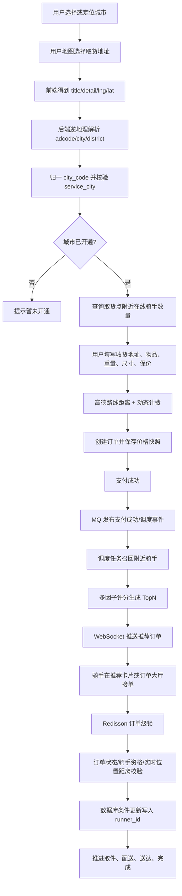

左上角城市选择只影响小程序展示和地图默认中心点；订单归属以后端解析取货地址为准。骑手能否看到订单，以骑手实时位置到取货点的距离为准。

## 3. 主链路表与字段

| 链路位置 | 表 | 关键字段 | 用法 |
|---|---|---|---|
| 城市开通 | `service_city` | `city_code`、`adcode`、`city_name`、`center_lng`、`center_lat`、`status` | 判断城市是否开通，提供城市选择和地图默认中心点 |
| 地址簿 | `address` | `uid`、`title`、`detail`、`lng`、`lat`、`name`、`phone` | 用户主动保存常用地址；临时地图选点不一定落库 |
| 用户/骑手身份 | `user_wx` | `uid`、`phone`、`is_runner`、`can_order`、`can_take`、`credit_score` | 判断用户能否下单、骑手能否接单，推荐时使用信用分 |
| 骑手位置 | `rider_latest_location` | `rider_id`、`city_code`、`lng`、`lat`、`is_online`、`last_report_time` | 附近骑手数量、附近订单召回、调度推荐 |
| 物品类型 | `tags` | `school_id`、`name`、`service_type`、`size_required` | 下单选择物品类型，大件可要求填写尺寸 |
| 计费规则 | `pricing_rule` | `city_code`、`service_type`、`base_fee`、`base_distance_m`、`per_km_fee`、`per_kg_fee`、`volume_weight_coefficient`、`insured_rate` | 计算预估运费和订单最终运费 |
| 订单主表 | `order_main` | `id`、`user_id`、`runner_id`、`start_address`、`end_address`、`pickup_city_code`、`pickup_adcode`、`pickup_lng`、`pickup_lat`、`distance_m`、`duration_sec`、`total_amount`、`status` | 保存订单地址快照、取货坐标、金额、状态、接单骑手 |
| 价格快照 | `order_price_snapshot` | `order_id`、`pricing_rule_id`、`rule_version`、`distance_m`、`charge_weight_kg`、`payable_amount`、`price_detail_json` | 固化下单时的计费明细，保证历史金额可追溯 |
| 支付状态 | `order_payment` | `order_id`、`payment_status`、`actual_payment`、`payment_time` | 记录支付结果，模拟支付和真实支付都落这里 |
| 履约进度 | `order_progress` | `order_id`、`accepted_time`、`delivering_time`、`delivered_time`、`completed_time`、`cancel_time` | 记录订单关键状态流转时间 |
| 调度任务 | `dispatch_task` | `order_id`、`round_no`、`city_code`、`pickup_lng`、`pickup_lat`、`radius_km`、`status` | 支付成功后生成调度任务，按取货点召回骑手 |
| 推荐记录 | `dispatch_offer` | `task_id`、`order_id`、`rider_id`、`rank_no`、`distance_to_pickup_m`、`dispatch_score`、`push_status`、`accept_time` | 记录推荐给哪些骑手、推送是否成功、是否被接单 |
| 骑手申请 | `runner_apply` | `uid`、`city_code`、`city_name`、`status` | 骑手按城市申请，审批通过后获得接单资格 |

运行参数来自配置文件，不存 MySQL：

| 配置项 | 含义 |
|---|---|
| `rider.location.expire-minutes` | 骑手位置有效期，过期位置不参与附近统计和调度 |
| `rider.location.nearby-count-radius-km` | 用户选择取货地址后统计附近骑手数量的半径 |
| `rider.location.nearby-order-radius-km` | 骑手订单大厅查询附近订单的半径 |
| `dispatch.round1-radius-km` / `dispatch.round2-radius-km` / `dispatch.round3-radius-km` | 调度推荐多轮扩圈半径 |

Stage 6 已删除旧的 `service_area`、`service_area_point` 表，以及所有 `service_area_id/service_area_name` 业务字段。当前数据库结构以 `service_city` 和 `order_main.pickup_*` 为主。

## 4. 模块一：城市、地址与地理基础能力

### 4.1 目标

把原来偏“校区 + 文本”的地址能力，升级为同城急送需要的“地图地址”。用户选择取货地址后，系统必须拿到经纬度、城市编码和行政区编码，并判断该城市是否开通。

### 4.2 流程

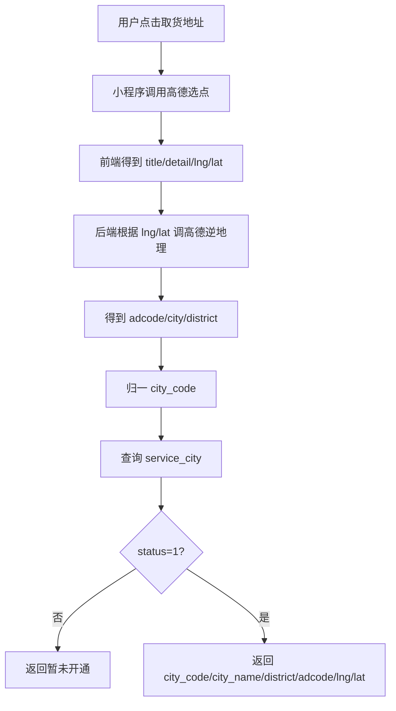

### 4.3 字段级用例解释

用户选择“黑龙江大学”作为取货地址。

小程序界面上只展示中文地址，例如“黑龙江大学”和“哈尔滨市南岗区学府路74号”。但代码层面不能只传中文地址，因为后续要判断城市是否开通、统计附近骑手、计算距离，所以前端会把地图选点返回的经纬度一起带给后端。

当前小程序通过 `uni.chooseLocation` 选点，前端实际组装的地址对象主要包括：

| 字段 | 示例 | 来源 | 用途 |
|---|---|---|---|
| `title` | 黑龙江大学 | 高德选点 | 页面展示、地址快照 |
| `detail` | 哈尔滨市南岗区学府路74号 | 高德选点/用户补充 | 页面展示、地址快照 |
| `lng` | `126.622980` | 高德选点 | 取货点经度 |
| `lat` | `45.708520` | 高德选点 | 取货点纬度 |

`adcode/city/district` 当前不是小程序界面直接展示或手动填写出来的字段，而是后端根据 `lng/lat` 再调用高德逆地理解析得到的结果：

| 字段 | 示例 | 来源 | 用途 |
|---|---|---|---|
| `adcode` | `230103` | 后端调用高德逆地理 | 区级行政编码，表示南岗区 |
| `city_code` | `230100` | 后端由区级 `adcode` 归一 | 城市级编码，表示哈尔滨市 |
| `district` | 南岗区 | 后端调用高德逆地理 | 地址快照展示和排查问题 |

后端处理时不是直接相信“南岗区”这个中文文本，而是先根据 `lng/lat` 调用高德逆地理，得到区级 `adcode` 和区县名称；然后再把区级 `adcode` 归一成城市级 `city_code`，用 `city_code` 判断这个城市是否开通。这里会用到两类编码：

| 编码 | 示例 | 含义 | 在项目中的作用 |
|---|---|---|---|
| `adcode` | `230103` | 高德返回的区级行政编码，表示南岗区 | 判断取货地址具体落在哪个区县 |
| `city_code` | `230100` | 后端归一后的城市编码，表示哈尔滨市 | 查询 `service_city` 判断城市是否开通 |

`service_city` 是项目新增的城市开通表，里面需要提前插入平台已开通城市的数据，例如哈尔滨、北京、上海。用户选择地址时，不是把地址和数据库中的某个地址逐条匹配，而是用高德解析出来的编码去查平台是否开通这个城市。

| 步骤 | 使用字段 | 查询/计算 |
|---|---|---|
| 识别区县 | `lng`、`lat` | 调用高德逆地理，得到区级 `adcode=230103` |
| 归一城市 | `adcode=230103` | 归一到哈尔滨 `city_code=230100` |
| 判断开通 | `city_code=230100` | 查询 `service_city.city_code=230100 AND status=1` |

如果 `service_city` 存在哈尔滨并且 `status=1`，接口返回：

```json
{
  "cityCode": "230100",
  "cityName": "哈尔滨市",
  "districtCode": "230103",
  "districtName": "南岗区",
  "lng": 126.622980,
  "lat": 45.708520
}
```

这一步只做地址识别和城市开通校验，不写 `order_main`。用户临时选择取货地址也不一定写 `address`；只有用户主动保存常用地址时，才写入 `address.uid/title/detail/lng/lat/name/phone`。

本模块可以简单理解为：

```text
用户选择取货地址
-> 前端返回 title/detail/lng/lat
-> 后端根据 lng/lat 逆地理得到 adcode
-> 后端归一 city_code
-> 查询 service_city.city_code/status
-> 已开通则允许继续展示附近骑手数量和计费入口
-> 未开通则直接提示暂未开通
```

## 5. 模块二：骑手位置服务与附近召回

### 5.1 目标

让用户端能看到取货点附近有多少在线骑手，让骑手端能看到当前位置附近的待接单订单。核心不再是固定区域，而是城市、实时位置和距离。

### 5.2 骑手位置上报

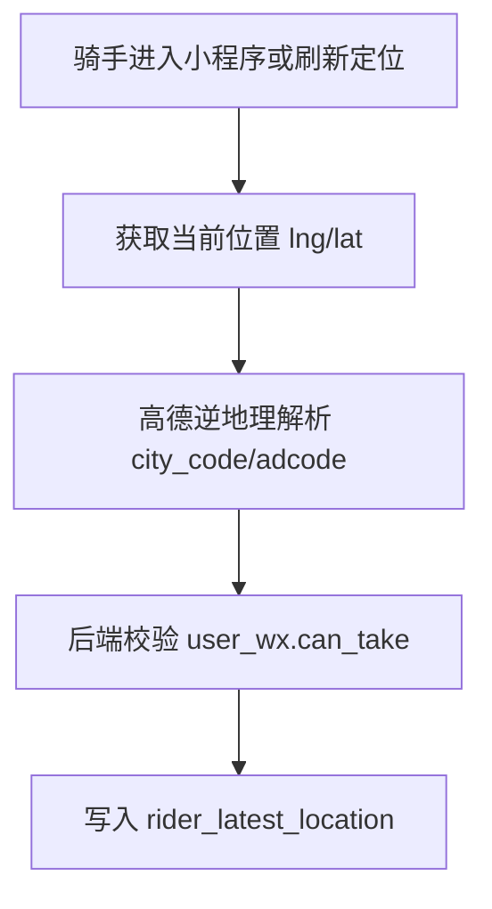

字段级说明：

| 阶段 | 使用字段 | 表 | 作用 |
|---|---|---|---|
| 校验骑手身份 | `uid`、`is_runner`、`can_take` | `user_wx` | 只有可接单骑手才允许上报工作位置 |
| 识别当前位置 | `lng`、`lat` | 高德/请求参数 | 解析骑手当前所在城市和行政区 |
| 写入最新位置 | `rider_id`、`city_code`、`city_name`、`district_code`、`district_name`、`lng`、`lat`、`is_online`、`last_report_time` | `rider_latest_location` | 一名骑手只保留一条最新位置 |

用例：

骑手当前定位在北京海淀区，后端写入：

```text
rider_latest_location.rider_id = 当前骑手 uid
rider_latest_location.city_code = 110100
rider_latest_location.district_code = 110108
rider_latest_location.lng / lat = 骑手当前位置
rider_latest_location.is_online = 1
rider_latest_location.last_report_time = 当前时间
```

后续附近骑手数量、附近订单大厅、调度推荐都基于这张表。

### 5.3 用户端附近骑手数量

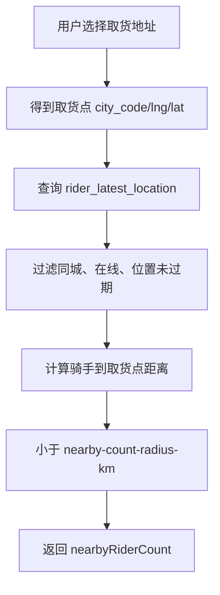

字段级用例：

用户选择“黑龙江大学”作为取货地址，模块一已经解析出：

```text
pickup city_code = 230100
pickup lng = 126.622980
pickup lat = 45.708520
```

后端查询 `rider_latest_location`，不会查 `order_main`，因为此时用户还没有创建订单。这里查询的是“当前取货点附近有多少在线骑手”。

| 条件 | 字段 | 说明 |
|---|---|---|
| 同城 | `city_code = 230100` | 只统计哈尔滨骑手 |
| 在线 | `is_online = 1` | 离线骑手不统计 |
| 位置新鲜 | `last_report_time >= now - expire-minutes` | 过期定位不可信 |
| 距离过滤 | `distance(rider.lng, rider.lat, pickup.lng, pickup.lat) <= nearby-count-radius-km` | 半径来自配置文件，不来自数据库 |

其中：

| 数据 | 来源 |
|---|---|
| `pickup.city_code/lng/lat` | 模块一地址解析结果 |
| `rider.city_code/lng/lat/is_online/last_report_time` | `rider_latest_location` |
| `nearby-count-radius-km` | 后端配置文件 |

最终返回 `nearbyRiderCount`。这一步只用于页面展示，不创建订单、不写 `order_main`。

### 5.4 骑手端附近订单大厅

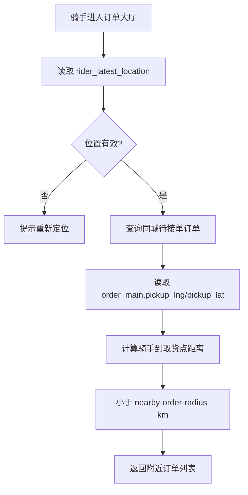

字段级用例：

骑手在北京，最新位置是：

```text
rider_latest_location.rider_id = 当前骑手 uid
rider_latest_location.city_code = 110100
rider_latest_location.lng / lat = 北京当前位置
rider_latest_location.last_report_time = 未过期
```

后端先根据 `rider_id` 读取 `rider_latest_location`。如果没有位置，或者 `last_report_time` 已经过期，直接提示骑手重新定位，不继续查订单。

位置有效后，后端再查 `order_main`，先用数据库字段缩小候选订单范围：

| 条件 | 字段 | 说明 |
|---|---|---|
| 同城订单 | `order_main.pickup_city_code = rider_latest_location.city_code` | 北京骑手只查北京取货订单 |
| 待接单 | `order_main.status = 待接单` | 只展示可接订单 |
| 未分配骑手 | `order_main.runner_id IS NULL` | 已被接单订单不展示 |
| 有取货坐标 | `pickup_lng`、`pickup_lat` 不为空 | 没有坐标无法计算距离 |

拿到候选订单后，再用骑手实时位置和订单取货点计算距离：

```text
distance(rider_latest_location.lng, rider_latest_location.lat,
         order_main.pickup_lng, order_main.pickup_lat)
<= rider.location.nearby-order-radius-km
```

最终返回订单大厅列表，常用返回字段包括 `order_id`、取货地址、收货地址、预估距离、订单金额、物品类型和是否为推荐订单。所以，如果数据库里有哈尔滨订单，但骑手当前定位在北京，哈尔滨订单不会进入候选列表。

## 6. 模块三：动态计费与价格快照

### 6.1 目标

把固定运费升级为同城急送计费模型，并把每次下单时的计费结果固化，避免规则变更影响历史订单。

### 6.2 计费流程

```mermaid
flowchart TD
    A[取货地址和收货地址都有 lng/lat] --> B[高德计算 distance_m/duration_sec]
    B --> C[读取 city_code 和 service_type]
    C --> D[查询 pricing_rule]
    D --> E[计算体积重和计费重量]
    E --> F[计算各项费用]
    F --> G[返回预估价或写价格快照]
```

字段级用例：

用户从“黑龙江大学”配送到“哈尔滨理工大学”，下单服务类型是帮取送：

```text
pickup_city_code = 230100
service_type = 0
start_address.lng / lat = 黑龙江大学坐标
end_address.lng / lat = 哈尔滨理工大学坐标
weight = 2kg
volume_length_cm / volume_width_cm / volume_height_cm = 可选
insured_amount = 可选
```

这里的 `pickup_city_code` 来自模块一的取货地址解析结果，不是用户手动选择的左上角城市。`service_type` 是用户下单选择的业务类型，例如帮取送、帮买、代排队等，用来匹配不同计费规则。

计费时查询 `pricing_rule`：

| 条件 | 字段 |
|---|---|
| 城市 | `pricing_rule.city_code = pickup_city_code` |
| 服务类型 | `pricing_rule.service_type = order.service_type` |
| 启用规则 | `pricing_rule.status = 1` |

路线距离来自高德，写入或使用：

| 字段 | 来源 | 用途 |
|---|---|---|
| `distance_m` | 高德路线规划 | 计算距离费，写入 `order_main` 和快照 |
| `duration_sec` | 高德路线规划 | 预计时长，写入 `order_main` |

价格快照写入 `order_price_snapshot`：

| 字段 | 说明 |
|---|---|
| `order_id` | 对应订单 |
| `pricing_rule_id` | 本单使用哪条规则 |
| `rule_version` | 规则版本 |
| `distance_m` | 本单计费距离 |
| `charge_weight_kg` | 计费重量，取实际重量和体积重较大值 |
| `base_fee` / `distance_fee` / `weight_fee` / `insured_fee` / `time_surcharge_fee` | 各项费用 |
| `payable_amount` | 最终应付金额 |
| `price_detail_json` | 完整计费明细 |

订单创建时还会把关键结果写入 `order_main.distance_m/duration_sec/total_amount/start_address/end_address/pickup_*`。订单创建后即使 `pricing_rule` 后续变化，历史订单仍按 `order_price_snapshot` 展示和结算。

本模块可以简单理解为：

```text
取货地址解析出 pickup_city_code
-> 取货和收货坐标调用高德算距离
-> 用 pickup_city_code + service_type 查 pricing_rule
-> 计算距离费、重量费、体积重、保价费、时段附加费
-> 写 order_main 金额字段和 order_price_snapshot
```

### 6.3 方案价值与指标口径

如果仍沿用原校园版固定运费，系统只能按校区或服务类型给出固定价格，无法解释为什么同城配送中远距离、大体积、夜间订单应该更贵，也无法保证历史订单在计费规则变化后仍能复盘。

本项目采用“规则表 + 实时计费 + 价格快照”的方案：

| 优化前 | 本项目方案 | 带来的提升 |
|---|---|---|
| 固定运费或简单阶梯价 | 按城市、服务类型读取 `pricing_rule` | 不同城市、不同业务类型可以配置不同价格 |
| 只按重量计费 | 引入体积重，取实际重量和体积重较大值 | 避免大体积轻货低价下单 |
| 只保存最终金额 | 写入 `order_price_snapshot` 保存规则版本和费用明细 | 历史订单金额可追溯 |
| 每次展示都重新按当前规则计算 | 订单创建时固化快照 | 规则调整不影响历史订单 |

简历中的指标建议按压测口径表达：

```text
通过规则查询优化和价格快照复用，将计费接口平均耗时由直接实时计算的约 80ms 降至 30ms 以内。
```

这里的“80ms -> 30ms”不是凭空写数字，面试时要解释为：优化前每次都要查规则、解析地址、计算多项费用；优化后把城市规则缓存起来，并在订单创建时保存价格快照，后续订单详情和列表展示不再重复计算。

## 7. 模块四：订单状态机与履约链路

### 7.1 目标

让订单从创建到完成有明确状态，避免支付、接单、配送、取消之间互相覆盖。

### 7.2 状态流

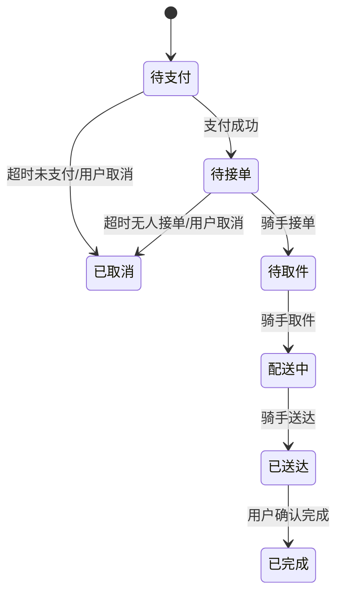

字段级用例：

用户创建订单时写入：

| 表 | 字段 | 值 |
|---|---|---|
| `order_main` | `status` | 待支付 |
| `order_main` | `user_id` | 当前用户 uid |
| `order_main` | `runner_id` | `NULL` |
| `order_payment` | `payment_status` | 未支付 |
| `order_progress` | `order_id` | 新订单 ID |

模拟支付成功后更新：

| 表 | 字段 | 值 |
|---|---|---|
| `order_main` | `status` | 待接单 |
| `order_payment` | `payment_status` | 已支付 |
| `order_payment` | `payment_time` | 当前时间 |

骑手接单成功后更新：

| 表 | 字段 | 值 |
|---|---|---|
| `order_main` | `runner_id` | 接单骑手 uid |
| `order_main` | `status` | 待取件/配送前状态 |
| `order_progress` | `accepted_time` | 当前时间 |

每次状态推进都不是直接覆盖状态，而是校验“当前状态是否允许进入下一个状态”。例如：

| 操作 | 必须满足的当前字段 | 更新后的字段 |
|---|---|---|
| 支付成功 | `order_main.status=待支付`、`order_payment.payment_status=未支付` | `order_main.status=待接单`、`payment_status=已支付` |
| 骑手接单 | `order_main.status=待接单`、`runner_id IS NULL` | `runner_id=骑手 uid`、`status=待取件` |
| 骑手开始配送 | `order_main.status=待取件`、`runner_id=当前骑手` | `status=配送中`、写 `delivering_time` |
| 骑手送达 | `order_main.status=配送中`、`runner_id=当前骑手` | `status=已送达`、写 `delivered_time` |
| 用户确认完成 | `order_main.status=已送达`、`user_id=当前用户` | `status=已完成`、写 `completed_time` |

这样可以避免“未支付订单被接单”“已完成订单又被取消”“不是当前骑手也能推进配送”等状态错乱。

### 7.5 模块五至模块八协同设计

模块五、模块六、模块七和模块八不是四条互相独立的功能线，而是围绕订单状态共同协作：

| 模块 | 核心职责 | 是否决定订单最终状态 |
|---|---|---|
| 模块五：接单一致性 | 校验骑手资格、控制并发、写入接单结果 | 是 |
| 模块六：RabbitMQ 事件驱动 | 传递支付、调度、接单、缓存失效等事件 | 否 |
| 模块七：运费规则缓存 | 加速共享运费规则查询，处理规则变更后的缓存失效 | 否 |
| 模块八：推荐与触达 | 召回骑手、生成 TopN、推送推荐订单 | 否 |

核心原则是：

```text
模块八负责“推荐给谁”
模块五负责“谁最终接单成功”
模块六负责“把后置流程异步串起来”
模块七负责“让查询更快，但不替代数据库事实”
```

### 7.5.1 模块五至模块八主协同图

下面展示模块五至模块八的企业级目标链路。消息只承担明确的业务边界；`DISPATCH_CREATE` 只是调度模块内部的中间步骤，不作为独立 MQ 事件保留。

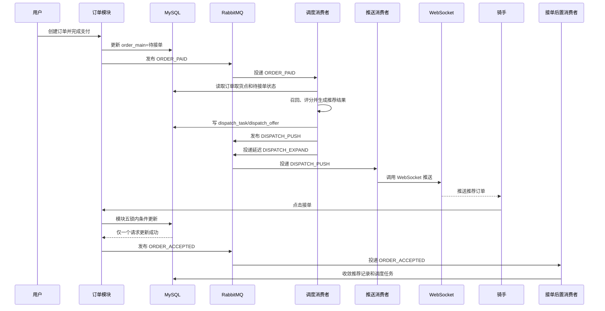

这张图表达的是模块之间的边界：推荐、推送和缓存失效都不能直接修改接单结果；只有模块五的事务写入成功后，才能发布 `ORDER_ACCEPTED` 后置事件。

### 7.5.2 图示步骤详解

这张图的主线是：用户支付成功后，订单服务不直接同步执行“找骑手、算推荐、推送订单”，而是先把支付成功这件事发布到 RabbitMQ；单体应用中的 MQ 消费者再异步调用调度模块完成后续工作。这样支付接口只需要完成订单状态更新和事件发布，不必等待骑手召回、推荐计算或 WebSocket 推送，支付、调度和推送就被解耦开了。这里虽然是单体 Spring Boot 项目，但订单模块、调度模块和推送模块仍然可以通过 RabbitMQ 异步协作；它们是同一个应用中的不同模块，不代表已经拆成微服务。

图中按业务职责只保留核心消息。每条消息都说明发送方、消费者和消费后的动作：

| 消息 | 谁发送 | 谁消费 | 消费后做什么 | 后续消息或动作 |
|---|---|---|---|---|
| `ORDER_PAID` | 订单模块。支付成功、订单事务提交后发布 | 调度消费者 | 校验订单状态，召回并排序附近骑手，生成 `dispatch_task`、`dispatch_offer` | 发布 `DISPATCH_PUSH` 和延迟 `DISPATCH_EXPAND` |
| `DISPATCH_PUSH` | 调度模块。推荐记录落库后发布 | 推送消费者 | 查询推荐记录，通过 WebSocket 触达骑手 | 离线或失败时由订单大厅兜底 |
| `DISPATCH_EXPAND` | 调度模块。生成本轮推荐后发布延迟消息 | 扩圈消费者 | 到期后重新查询订单状态，仍待接单才扩大半径并生成下一轮推荐 | 再次发布 `DISPATCH_PUSH` |
| `ORDER_ACCEPTED` | 接单模块。核心接单事务提交后发布 | 接单后置消费者 | 收敛其他推荐、更新调度任务、通知用户 | 不回滚核心接单结果 |

你刚才问的 `DISPATCH_PUSH`，答案是：**对，它就是给 WebSocket 推送流程准备的 MQ 消息。** 调度消费者负责召回骑手、计算推荐并写入推荐记录，但不直接等待 WebSocket 推送完成；调度结束后发布 `DISPATCH_PUSH`，WebSocket 推送消费者消费这条消息，再找到对应骑手的连接并发送推荐订单。这样即使 WebSocket 暂时不可用，也不会影响订单已经支付和推荐结果已经生成，骑手仍可从订单大厅主动查看附近订单。

完整流转可以按下面理解：

```text
用户支付成功
-> 订单模块更新 MySQL
-> 发布 ORDER_PAID
-> 调度消费者召回和排序骑手，写推荐记录
-> 推送消费者通过 WebSocket 推送，失败时由订单大厅兜底
-> 骑手点击接单
-> 模块五同步执行 Redisson 锁和 MySQL 条件更新
-> 接单成功后发布 ORDER_ACCEPTED
-> 后置消费者收敛推荐记录、通知用户
```

这条链里真正需要同步、必须立刻得到结果的只有“骑手接单”这一步，因为它决定订单最终归谁；支付后的调度、推荐推送和接单后的通知都可以异步化。运费规则缓存失效属于规则配置更新链路，由模块七单独处理。MQ 的作用不是替代数据库，也不是决定谁接单成功，而是把这些耗时、可重试、失败后可补偿的后置任务从主接口中拆出去。


### 7.5.3 同步主链路与异步后置链路

```text
同步强一致链路：
骑手点击接单
-> 获取订单锁
-> 查询订单最新状态
-> 校验骑手资格和位置
-> MySQL 条件更新 order_main
-> 写入 order_progress
-> 提交事务
-> 发布 ORDER_ACCEPTED

ORDER_ACCEPTED 后置处理：
ORDER_ACCEPTED 被接单后置消费者消费
-> 再次查询 order_main，确认订单已经接单
-> 在一个后置事务中收敛 dispatch_offer 和 dispatch_task
-> 后置事务提交成功
   └── 通知用户和相关骑手

已进入 RabbitMQ 的扩圈消息：
扩圈消息到期
-> 扩圈消费者查询 order_main 最新状态
-> 已接单：忽略本次扩圈
-> 仍待接单：进入下一轮扩圈
```

这里需要区分两种顺序。第一种是接单后置消费者内部的业务顺序：先确认订单状态，再收敛推荐记录和调度任务，提交后置事务；只有后置事务成功后，才发送通知。这样可以避免通知已经发出，但推荐记录仍显示“推荐中”的短暂不一致。

第二种是后置动作之间的关系。通知和推荐收敛都属于接单成功后的后置处理，一个动作失败不应回滚已经成功的接单结果。运费规则缓存失效不属于 `ORDER_ACCEPTED` 后置流程，具体顺序见模块七。扩圈也不是通知之后的最后一步，它通常已经由前一轮调度提前投递到延迟队列，消息到期后由扩圈消费者独立检查订单状态。

扩圈任务不依赖一个额外的“取消扩圈”消息才能保证正确。即使扩圈消息已经在 RabbitMQ 中，扩圈消费者消费时仍然要重新查询订单状态；如果订单已经被接单，就直接确认并忽略本次扩圈。推送失败或推荐记录更新失败时，都不能回滚已经成功的接单结果，而是由模块六通过重试、死信队列和补偿任务保证后置状态最终收敛。

## 8. 模块五：接单一致性保障与订单级并发控制

### 8.1 目标

接单是一条强一致业务链路，目标不是“尽量少出错”，而是必须保证同一订单最终只能被一个骑手接单成功。这个模块对应简历中的“接单一致性保障”，重点解决重复点击、网络重试、多骑手同时抢单、推荐卡片和订单大厅同时接单等并发场景。

接单成功的判定只看数据库最终状态：

```text
order_main.runner_id = 接单骑手 uid
order_main.status = 待取件
order_progress.accepted_time = 接单时间
```

WebSocket 推送、推荐记录更新和订阅消息通知都属于接单成功后的后置动作。这些动作失败不能回滚已经成功的接单结果，否则会把核心状态和外围通知耦合在一起。

### 8.2 并发问题来源

即时配送的抢单并发不是单纯“很多骑手同时点按钮”，实际来源包括：

| 并发来源 | 典型表现 | 风险 |
|---|---|---|
| 多骑手同时抢同一订单 | 多个骑手在订单大厅看到同一单并点击接单 | 一单多骑手 |
| 同一骑手重复点击 | 小程序按钮连点、弱网下重复提交 | 重复推进订单状态 |
| 客户端网络重试 | 接口超时后前端或网关重发请求 | 重复写入接单记录 |
| 多入口接单 | 推荐卡片和订单大厅都能进入接单接口 | 状态判断不一致 |
| WebSocket 延迟 | 骑手看到的推荐卡片已经过期 | 接到已被抢走的订单 |

如果只做普通逻辑：

```text
select order_main where id（订单id） = ?
if status == 待接单:
    update order_main set runner_id = ?
```

两个请求可能同时读到“待接单”，然后都尝试更新订单，最终导致 `runner_id` 被覆盖、`order_progress` 重复写入，或者推荐记录和订单主表状态不一致。

### 8.3 市面常见方案对比

| 方案 | 做法 | 优点 | 问题 |
|---|---|---|---|
| 只查状态再更新 | 先查订单状态，再改 `runner_id` | 实现最简单 | 并发下存在竞态，不能保证唯一接单 |
| 数据库悲观锁 | `select ... for update` 锁订单行 | 一致性强 | 长事务阻塞数据库，热点订单下吞吐下降 |
| 数据库乐观锁 | 增加 `version` 字段，更新时校验版本 | 不依赖 Redis | 抢单热点下大量失败重试，业务校验仍分散 |
| 只做条件更新 | `where status=待接单 and runner_id is null` | 能保证最终只有一个成功 | 所有并发请求都打到数据库，热点订单压力集中 |
| Redis `setnx` 手写锁 | 用 Redis key 控制互斥 | 性能好 | 可重入、续期、异常释放、误删锁都要自己处理 |
| MQ 串行接单 | 接单请求进入队列后串行消费 | 理论一致性强 | 实时性差，骑手点击后等待明显，不适合抢单体验 |
| Redisson + DB 条件更新 | 订单维度分布式锁 + 状态校验 + SQL 兜底 | 兼顾实时性、并发削峰和最终一致性 | 依赖 Redis，需要设计超时和降级 |

本项目采用最后一种方案：**Redisson 负责同一订单接单逻辑的互斥，数据库条件更新负责最终数据正确性兜底**。不能只说“用了 Redisson”，因为分布式锁是并发控制手段，不是最终一致性的唯一来源。

### 8.4 本项目最终方案

接单链路按订单维度加锁：

```text
lockKey = order:accept:{orderId}
```

锁内只做核心接单判断和状态变更：

| 步骤 | 表/数据 | 校验或操作 |
|---|---|---|
| 读取订单 | `order_main.id` | 订单必须存在 |
| 状态校验 | `order_main.status` | 必须是待接单 |
| 骑手校验 | `order_main.runner_id` | 必须为空 |
| 用户校验 | `order_main.user_id` | 骑手不能接自己的订单 |
| 资格校验 | `user_wx.can_take` | 骑手必须允许接单 |
| 位置校验 | `rider_latest_location.city_code/lng/lat/last_report_time` | 骑手定位必须有效 |
| 距离校验 | `order_main.pickup_lng/pickup_lat` | 骑手必须在可接范围内 |
| 条件更新 | `order_main` | 只允许待接单且未绑定骑手的订单被更新 |
| 进度写入 | `order_progress.accepted_time` | 记录接单时间 |

核心 SQL：

```sql
UPDATE order_main
SET runner_id = ?,
    status = ?
WHERE id = ?
  AND status = ?
  AND runner_id IS NULL;
```

影响行数必须等于 `1` 才算接单成功。影响行数为 `0`，说明订单已经被其他骑手接走，或者订单状态已经变化。

### 8.5 接单主流程图

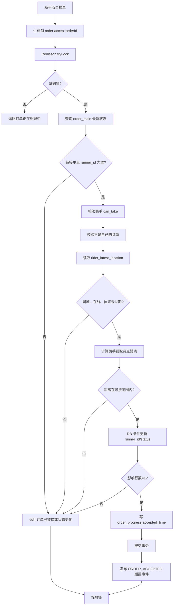

### 8.5.1 Redisson 锁与数据库兜底细节图

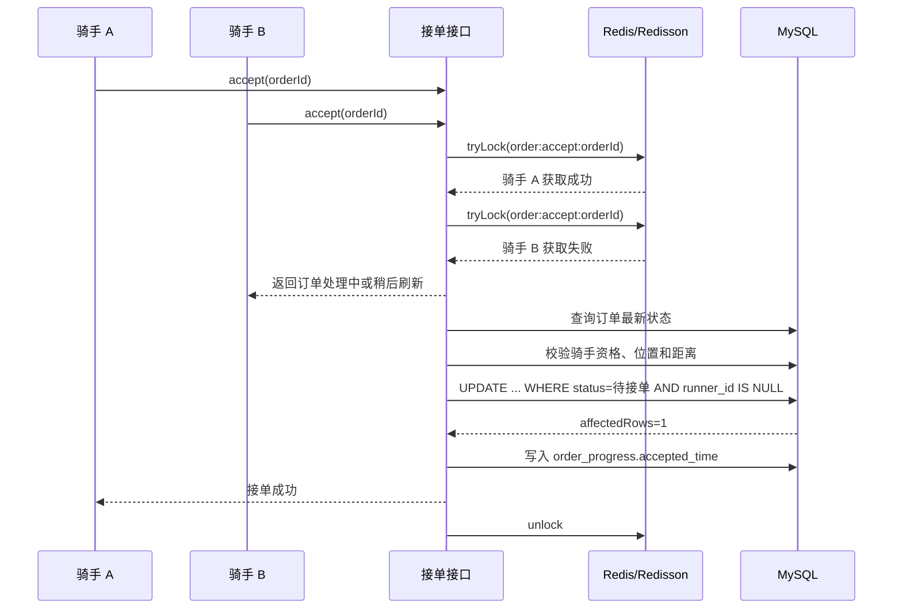

即使出现锁失效、请求绕过锁或多个服务实例并发执行，数据库条件更新仍然要求订单必须处于待接单且 `runner_id IS NULL`，因此最终只有一个请求能够更新成功。

### 8.6 后置动作为什么要异步化

接单成功后会触发很多动作：

```text
更新 dispatch_offer，把当前骑手标记为已接单
关闭同一订单其他骑手的推荐记录
更新 dispatch_task 状态为已接单
通知用户订单已被接单
通知其他骑手该订单已不可接
记录骑手活跃数据
取消或忽略后续扩圈调度任务
```

这些动作不应该全部放在 Redisson 锁内同步执行。锁内同步执行越多，锁持有时间越长，后续骑手请求等待越久。最终方案中，锁内只做订单主表和履约进度的核心写入；接单成功后发布 `ORDER_ACCEPTED` 事件，由 RabbitMQ 异步处理推荐记录收敛和通知推送。

### 8.6.1 接单成功后的后置事件图

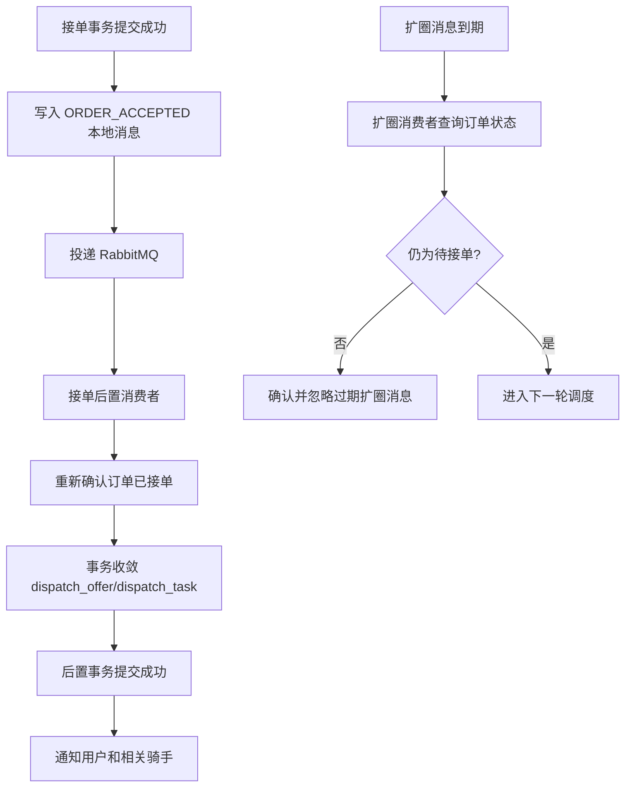

后置消费者先完成推荐记录和调度任务的数据库收敛，再执行通知。运费规则缓存不属于接单后的缓存失效范围，规则更新时由模块七单独处理。`order_main.runner_id/status` 是接单结果，推荐记录和通知是后置结果，后置消费者失败时可以重试，不应该反向修改已经成功的接单状态。

### 8.7 性能收益与压测指标

Redisson 的作用不是让单次 SQL 更快，而是把同一订单的高并发冲突挡在 Redis 锁层，避免所有请求都进入数据库更新。真正的企业级表达不能只写“用了分布式锁”，而要讲清楚优化前后差异。

| 优化前问题 | 本项目方案 | 带来的提升 |
|---|---|---|
| 先查状态再更新，存在并发覆盖 | `order:accept:{orderId}` 订单级 Redisson 锁 | 同一订单的并发请求先在 Redis 层排队或快速失败 |
| 只依赖分布式锁，锁异常时风险高 | `UPDATE ... WHERE status=待接单 AND runner_id IS NULL` | 数据库作为最终兜底，保证最终只成功一人 |
| 锁内同步做推送、缓存、推荐记录更新 | 锁内只更新 `order_main/order_progress`，后置动作发 MQ | 缩短锁持有时间，降低热点订单等待 |
| 推荐卡片和订单大厅多入口接单 | 所有入口统一走同一个接单接口 | 避免不同入口校验不一致 |
| 失败请求返回系统错误 | 抢单失败返回业务态，例如已被接单或处理中 | 用户体验更符合抢单场景 |

压测口径：

```text
准备同一个待接单订单
准备 50 个骑手账号或 token
JMeter 50 并发同时请求同一接单接口
校验只有 1 个业务成功
校验 order_main.runner_id 只有一个值
校验 order_progress.accepted_time 只写入一次
```

指标写法建议：

```text
通过订单级 Redisson 锁和数据库条件更新兜底，将多骑手并发抢单场景下的重复接单率降至 0%。
```

如果简历空间允许，可以再补一句“将热点订单并发冲突前置到 Redis 锁层，减少无效数据库更新请求”。这里的“失败请求”不是系统错误，而是抢单业务中的正常失败。

### 8.8 风险与降级

| 风险 | 处理方式 |
|---|---|
| Redisson 获取锁失败 | 返回“订单正在处理中”，前端刷新订单状态 |
| 业务执行异常导致锁未释放 | 使用 `finally unlock`，并设置合理 leaseTime |
| 服务宕机 | Redisson 锁到期自动释放，不会永久死锁 |
| Redis 不可用 | 安全优先返回系统繁忙；可用性优先时降级 DB 条件更新并限流 |
| WebSocket 推送失败 | 不影响接单结果，骑手订单大厅仍能拉取最新状态 |
| 缓存删除失败 | 通过 MQ 补偿删除，短 TTL 兜底 |

### 8.9 简历对应表达

这一模块支撑简历中的：

```text
接单一致性保障：针对重复点击、网络重试和多骑手并发抢单问题，基于 Redisson 实现订单级互斥锁，结合订单状态二次校验与数据库条件更新兜底；50 并发抢单下重复接单率 0%。
```

面试中要强调：

```text
Redisson 做互斥，数据库条件更新做最终兜底，MQ 处理接单成功后的非核心动作。
```

## 9. 模块六：RabbitMQ 事件驱动与异步履约处理

### 9.0 RabbitMQ 基础概念

RabbitMQ 可以理解为订单系统和后置处理模块之间的消息中转站。项目中的 Spring Boot 单体应用既可以发送消息，也可以消费消息；RabbitMQ 作为独立的 Broker 运行，负责接收、路由、暂存和投递消息。

#### 9.0.1 组件层级

```text
RabbitMQ Broker
├── Exchange 交换机
├── Queue 队列
├── Binding 绑定关系
├── Connection 连接
└── Channel 通道
```

其中，Broker 是 RabbitMQ 服务本身，Exchange 和 Queue 都属于 Broker 管理的对象。Exchange 不包含 Broker，RabbitMQ Broker 才是上层服务。

#### 9.0.2 一条消息的基本流转

```text
Producer 业务模块
-> 通过 Connection/Channel 连接 RabbitMQ Broker
-> Broker 内部的 Exchange
-> 根据 Binding 和 RoutingKey 路由
-> Queue
-> Consumer 消费者
-> 执行业务
-> 手动 ACK
```

这里不要理解成“消息先进入 Broker，再从 Broker 传到 Exchange”。`Broker` 是 RabbitMQ 服务整体，`Exchange` 和 `Queue` 都是 Broker 内部的组件。生产者连接 Broker 后，消息直接发布到 Broker 内部的 Exchange；Exchange 再根据绑定关系把消息路由到 Queue。

各组件职责如下：

| 概念 | 作用 | 本项目中的例子 |
|---|---|---|
| Broker | RabbitMQ 服务，负责接收、路由和投递消息 | Docker 启动的 RabbitMQ |
| Exchange | 根据路由规则决定消息进入哪个队列 | `order.exchange` |
| Queue | 暂存等待消费的消息 | `order.paid.dispatch.queue` |
| Binding | 建立 Exchange 和 Queue 的绑定关系 | `order.paid -> order.paid.dispatch.queue` |
| Producer | 发送消息的业务模块 | 订单模块、调度模块、接单模块 |
| Consumer | 消费消息并执行业务的模块 | 调度消费者、推送消费者 |
| RoutingKey | 生产者发送时使用的路由标识 | `order.paid`、`dispatch.push` |

例如支付成功事件：

```text
订单模块 Producer
-> order.exchange
-> RoutingKey=order.paid
-> order.paid.dispatch.queue
-> 调度 Consumer
```

RabbitMQ 只负责投递，不负责查询订单、召回骑手、修改订单或调用 WebSocket。具体业务始终由消费者执行。

#### 9.0.3 Publisher Confirm 和 Consumer ACK

这两个 ACK 属于不同阶段，不能混在一起：

```text
Publisher Confirm：
Producer -> RabbitMQ Broker
确认生产者这次发布是否被 RabbitMQ 接收。

Consumer ACK：
Consumer -> RabbitMQ Broker
确认消费者对应的业务是否已经处理成功。
```

生产者发送消息时开启 Publisher Confirm，RabbitMQ 会返回 `ACK`、`NACK` 或在超时时间内没有回执。它们只表示生产者发布阶段的结果，不表示消费者已经执行业务：

```text
ACK：
RabbitMQ 已经接收并处理这次发布请求。

NACK 或超时：
生产者无法确认这次发布成功，进入重试或补偿。
```

同时开启 `mandatory=true` 和 `ReturnCallback`，用于补充判断消息是否成功路由到 Queue。Confirm ACK 只能说明 RabbitMQ 接收了发布请求；如果 Exchange 找不到匹配的 Queue，仍会触发 `ReturnCallback`。因此，生产者需要同时处理 Confirm 和 ReturnCallback。

消费者使用手动 ACK 时，只有业务事务提交成功后才确认：

```text
收到消息
-> 执行业务
-> 数据库事务提交成功
-> ACK
```

如果消费者执行业务失败，则不应提前 ACK，而是进入消费重试或死信处理。生产者的 Publisher Confirm 和消费者的手动 ACK，分别解决“消息有没有可靠发布”和“业务有没有成功消费”两个问题。

#### 9.0.4 本项目的目标消息链路

```text
支付成功
-> 订单模块事务提交并发布 ORDER_PAID
-> RabbitMQ 路由到调度队列
-> 调度消费者召回并排序附近骑手
-> 写入 dispatch_task/dispatch_offer
-> 发布 DISPATCH_PUSH
-> 推送消费者调用 WebSocket 或微信订阅消息
-> 骑手点击接单
-> 模块五完成 Redisson + MySQL 条件更新
-> 接单模块发布 ORDER_ACCEPTED
-> 接单后置消费者收敛推荐和通知
```

这条链路中：

```text
Exchange 负责找队列
Queue 负责暂存消息
Consumer 负责执行具体业务
Publisher Confirm 负责确认生产者发送结果
Consumer ACK 负责确认消费者处理结果
幂等、重试和死信负责处理异常
```

### 9.1 目标

RabbitMQ 在本项目中只承担异步事件传递，不直接修改订单，也不直接调用 WebSocket。具体业务模块负责发送消息，RabbitMQ 负责路由和投递，消费者负责执行业务。

它主要解决三个问题：

| 目标 | 说明 |
|---|---|
| 解耦 | 支付、调度、推送和接单后置处理不放在同一个同步接口中 |
| 削峰 | 支付高峰时，调度任务进入队列，由消费者按能力处理 |
| 补偿 | 消息发送失败、消费失败和推送失败可以重试或进入死信 |

订单主链路仍以 MySQL 为准。MQ 不负责判断订单是否支付成功或接单成功，只传递已经由数据库确认的业务事件。

### 9.2 MQ 应用场景总览

从业务职责看，主链路只保留有明确业务意义的消息。`DISPATCH_CREATE` 不作为独立事件保留，因为它只是调度模块内部的中间步骤；支付成功事件消费后可以直接调用调度模块完成创建任务、召回和排序。

| 消息 | 谁发送 | 谁消费 | 消费后做什么 |
|---|---|---|---|
| `ORDER_PAID` | 订单模块。支付成功事务提交后发送 | 调度消费者 | 校验订单状态，召回并排序附近骑手，写入 `dispatch_task`、`dispatch_offer`，再发布推送和延迟扩圈事件 |
| `DISPATCH_PUSH` | 调度模块。推荐记录提交后发送 | 推送消费者 | 查询推荐记录，通过 WebSocket 触达骑手；失败时记录状态，由订单大厅兜底 |
| `DISPATCH_EXPAND` | 调度模块。生成本轮推荐后发送延迟消息 | 扩圈消费者 | 到期后重新查询订单状态，仍待接单才扩大半径并生成下一轮推荐 |

下面两类属于同一套企业级方案中的其他事件：

| 规划消息 | 发送时机 | 作用 |
|---|---|---|
| `ORDER_ACCEPTED` | 接单事务提交成功后 | 异步收敛其他推荐、更新调度任务和通知用户 |
| `ORDER_PAY_TIMEOUT` | 创建待支付订单后 | 延迟到期后重新检查订单，满足条件才取消 |

支付超时取消可以使用同一套延迟消息机制：

```text
创建待支付订单
-> 投递带延迟时间的 ORDER_PAY_TIMEOUT
-> 延迟到期后查询 order_main
-> 仍未支付才取消订单
-> 已支付则确认并忽略消息
```

### 9.3 事件驱动总流程

这条链路只保留有独立业务意义的消息。`DISPATCH_CREATE` 只是“创建调度任务”的内部中间事件，不能带来新的业务边界；本方案直接由 `ORDER_PAID` 消费者调用调度模块完成召回和推荐，减少一次 MQ 转发和一次消费开销。

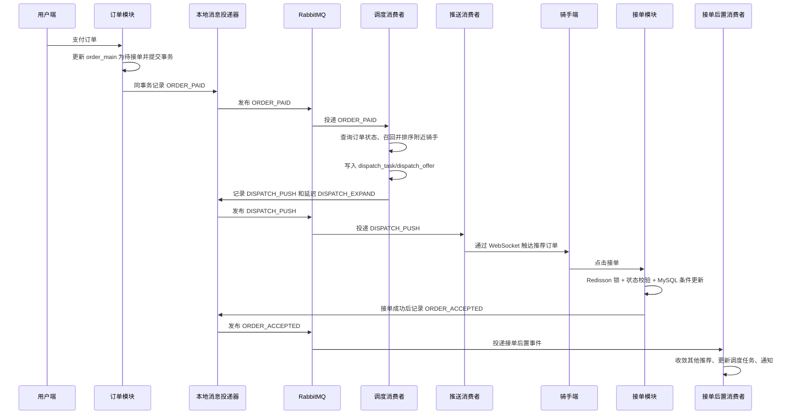

这张图中，RabbitMQ 只负责传递事件，具体模块负责业务动作：订单模块产生 `ORDER_PAID`，调度消费者负责召回和排序，推送消费者负责读取推荐记录并调用 WebSocket，接单模块负责同步完成唯一接单，接单后置消费者负责处理外围数据。支付接口不等待调度、推送和通知完成；接单接口也不把关闭其他推荐等动作放在核心事务中。

`DISPATCH_EXPAND` 是从第一轮推荐分出的延迟支线，不是 `DISPATCH_PUSH` 的同步下一步：

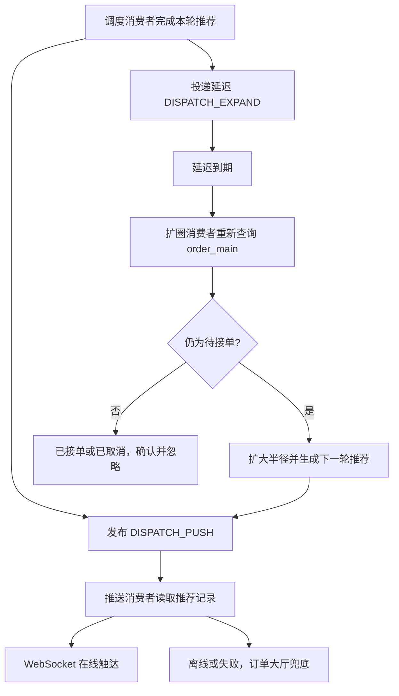

因此消息关系是“一条主链路加一条延迟支线”：

```text
ORDER_PAID
-> 调度消费者生成本轮推荐
   ├── DISPATCH_PUSH -> 推送消费者 -> WebSocket/订单大厅
   └── DISPATCH_EXPAND -> 到期检查状态 -> 未接单则重新推荐

骑手点击接单并成功提交核心事务
-> ORDER_ACCEPTED -> 接单后置消费者
```

扩圈消费者每次都必须重新查询数据库。它不能根据 WebSocket 是否发送成功判断订单是否仍然待接单，也不能依赖消息生成时保存的旧状态。

### 9.3.1 RabbitMQ 拓扑与事件流细节图

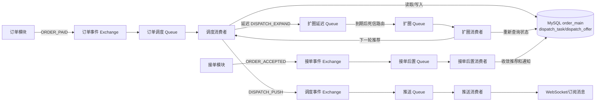

图中省略了 RabbitMQ Broker 的内部层级，实际关系是：每个 Exchange 和 Queue 都由 RabbitMQ Broker 管理；业务模块通过 Connection/Channel 发布消息，消费者从 Queue 接收消息。单体应用可以同时包含订单模块、调度模块、推送消费者和接单后置消费者，但 RabbitMQ 仍然是独立运行的中间件。RabbitMQ 不查询数据库，也不调用 WebSocket，所有业务动作都由具体消费者完成。

### 9.3.2 关键消息的发送顺序

```text
ORDER_PAID：
订单支付成功
-> order_main 更新为待接单并提交
-> 订单模块发布 ORDER_PAID
-> 调度消费者校验订单状态
-> 召回、排序骑手并写入 dispatch_task/dispatch_offer
-> 记录并发布 DISPATCH_PUSH
-> 同时投递延迟 DISPATCH_EXPAND

DISPATCH_PUSH：
调度推荐事务提交
-> 推送消费者消费
-> 根据 riderId 查询有效连接
-> 在线则通过 WebSocket 推送
-> 离线或推送失败则记录状态，由订单大厅兜底

ORDER_ACCEPTED：
骑手接单核心事务提交
-> 接单模块发布 ORDER_ACCEPTED
-> 接单后置消费者消费
-> 关闭其他推荐、更新调度任务、发送用户通知
```

`DISPATCH_EXPAND` 在延迟到期后由扩圈消费者重新查询订单状态；如果仍待接单，生成下一轮 `dispatch_task/dispatch_offer`，再由调度模块发布下一条 `DISPATCH_PUSH` 和下一轮延迟扩圈消息。MQ 只负责传递事件，发布下一条消息的始终是完成当前业务动作的具体模块，不是 RabbitMQ 自己发送。

### 9.4 共性可靠性机制

企业级方案中的关键消息都遵循同一套 RabbitMQ 可靠性规则：

```text
统一消息结构
-> 生产者确认
-> Exchange/Queue/Message 持久化
-> 消费者手动 ACK
-> Redis 幂等 + 数据库状态兜底
-> 失败进入延迟重试
-> 长期失败进入死信和补偿
```

不同消息只在“什么时候发送、消费后做什么、失败后补偿什么”上存在差异。

#### 9.4.1 消息发送可靠性

业务事务成功后，生产者先生成稳定的 `eventId` 和 `bizId`，再通过 Publisher Confirm 和 `mandatory + ReturnCallback` 发布消息。这里的完整路径是：

```text
Producer
-> RabbitMQ Broker 内部的 Exchange
-> Exchange 按 Binding 和 RoutingKey 路由到 Queue
-> Publisher Confirm 返回 ACK/NACK 或超时
```

RabbitMQ 中的 Broker 是服务整体，Exchange 和 Queue 都是 Broker 内部的组件。生产者不会分别“重试 Broker”或“重试 Exchange”，也不存在从 Exchange 单独发往 Queue 的重试。无论是 NACK、Confirm 超时，还是发送调用失败，重试时都由生产者重新发布同一条业务消息，再完整经过：

```text
Producer
-> RabbitMQ Broker 内部的 Exchange
-> Exchange 按 Binding 和 RoutingKey 路由到 Queue
```

`eventId` 在重试过程中保持不变，用于标识同一次业务事件；消费者使用它实现幂等，避免消息重复投递导致业务重复执行。

发送端的主流程如下：

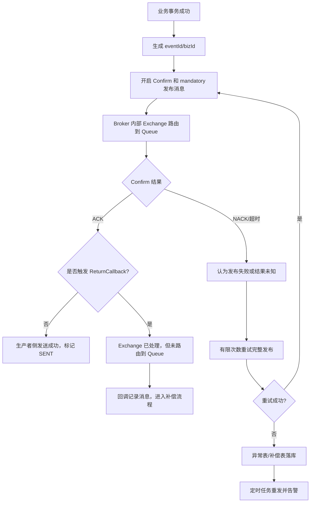

图中的 `ACK`、`NACK` 和超时都属于生产者发布阶段的结果。`ACK` 且没有 `ReturnCallback` 时，说明消息已经完成生产者侧发布和路由；`NACK` 或超时表示这次发布没有得到成功确认，生产者需要有限次数重试。每次重试都是重新发布完整消息，不是让 RabbitMQ 从某个中间节点继续发送。

`ReturnCallback` 处理的是另一种情况：Exchange 已经收到消息，但没有找到匹配的 Queue。它通常是回调通知，不一定会让原始发送方法直接抛出异常，因此不能直接依赖 Spring Retry 自动处理。回调中应记录待补偿消息，修复路由配置后，再由补偿任务重新发布完整消息。

因此，生产者侧只需要记住三种结果：

```text
ACK 且没有 ReturnCallback
-> 消息发布并路由成功

NACK、Confirm 超时或发送失败
-> 有限重试，失败后落库补偿

ReturnCallback
-> Exchange 到 Queue 路由失败，记录并补偿重发
```

其中 `ReturnCallback` 不是消费者失败回调，也不负责处理 Queue 中的业务异常；消息进入 Queue 后，才由消费者通过幂等校验、业务事务和手动 ACK 继续处理。

#### 9.4.2 Broker、Exchange、Queue 和 Message 持久化

为了避免 RabbitMQ 重启后基础设施或未消费消息丢失，需要分别配置：

| 配置 | 持久化内容 | 作用 |
|---|---|---|
| `Exchange durable=true` | 交换机定义 | Broker 重启后交换机仍存在 |
| `Queue durable=true` | 队列定义和元数据 | Broker 重启后队列仍存在 |
| `deliveryMode=2` | 队列中的具体消息 | 未消费消息可以从磁盘恢复 |

三者不是同一个概念：

```text
Exchange 持久化：
保证路由入口还存在。

Queue 持久化：
保证存放消息的队列还存在。

Message 持久化：
保证队列中的具体业务消息还存在。
```

只有三者同时满足，才能较完整地应对 Broker 重启。持久化不等于绝对不丢，还需要 Publisher Confirm、手动 ACK、重试和死信机制。

#### 9.4.3 消费成功确认：手动 ACK

消息进入 Queue 并被 Consumer 拿到，只能说明“开始处理”，不代表业务已经消费成功。只有业务数据成功落库、事务提交后，才确认这条消息已经被正常消费。

消费者采用手动 ACK，而不是自动 ACK：

```text
收到消息
-> 执行校验和业务事务
-> 数据库事务提交成功
-> basicAck
```

消费阶段可以单独理解为：

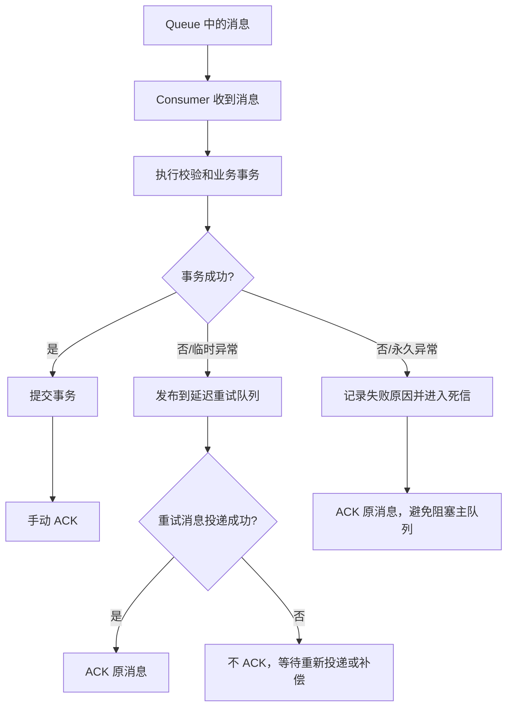

这样可以避免消息刚投递就被删除，但业务还没有落库成功。

如果业务失败：

```text
临时失败
-> 发布带 retryCount 的延迟重试消息
-> 重试消息成功进入重试队列后 ACK 原消息
-> 重试消息投递失败则不 ACK，等待 RabbitMQ 重投或补偿任务

永久失败
-> 记录异常
-> 进入死信或失败表
-> ACK 原消息，避免坏消息阻塞主队列
```

如果业务已经成功但 ACK 因网络抖动丢失，RabbitMQ 可能再次投递。此时不能再次执行业务，而是通过下一节的幂等状态判断后直接 ACK。

#### 9.4.4 重复消费与幂等处理

RabbitMQ 通常按至少一次投递处理。消费者异常、网络抖动、ACK 丢失或人工重试，都可能导致同一条消息再次到达。消费幂等采用三层保障：

```text
Redis 原子标记：控制同一 bizId 只有一个消费者进入业务处理
Redis 状态查询：判断业务已经成功，还是仍在处理中
数据库唯一索引：Redis 失效或并发穿透时做最终兜底
```

消费者收到消息后，不直接把每条消息都写入数据库，而是先尝试原子抢占处理资格：

```text
消费者收到消息
-> 尝试 SET consume:{bizId}=PROCESSING NX EX 60
```

这里的 `NX` 表示 Key 不存在时才写入，`EX 60` 表示 `PROCESSING` 最多保留 60 秒。它本质上就是带过期时间的 Redis `SETNX`：

```text
返回成功：
-> 当前消费者获得处理资格
-> 执行业务事务
-> 数据库事务提交成功
-> Redis 更新为 SUCCESS
-> 手动 ACK
```

如果 Redis 已经存在该 `bizId`，先根据状态判断：

```text
状态为 SUCCESS
-> 业务已经成功落库
-> 不重复执行业务
-> 直接 ACK

状态为 PROCESSING
-> 可能有其他消费者正在处理
-> 当前消费者不并发执行业务
-> 进入延迟重试
```

如果 `PROCESSING` 超过 TTL 后自动过期，说明原消费者可能已经异常退出，后续消费者可以重新抢占并处理。

数据库唯一索引是最后一道兜底。例如 Redis 标记过期或多个请求极端并发穿透时，两个消费者可能同时尝试创建同一业务记录，但数据库中 `bizId` 唯一索引只允许一个插入成功。另一个请求遇到唯一键冲突后，应查询业务状态，将其视为“业务已经完成”，补写 Redis `SUCCESS` 并 ACK，而不是继续重复重试。

因此，完整幂等逻辑是：

```text
Redis 负责快速拦截重复并发
-> 数据库事务负责真正落库
-> 数据库唯一索引负责最终防重
-> 业务成功后更新 Redis SUCCESS
-> 最后手动 ACK
```

Redis 只是幂等加速层，不能替代数据库最终状态。尤其不能因为 `SETNX` 失败就无条件 ACK：如果对方只是处于 `PROCESSING`，直接 ACK 可能导致业务尚未落库的消息被错误丢弃。

#### 9.4.5 消费失败、重试和死信

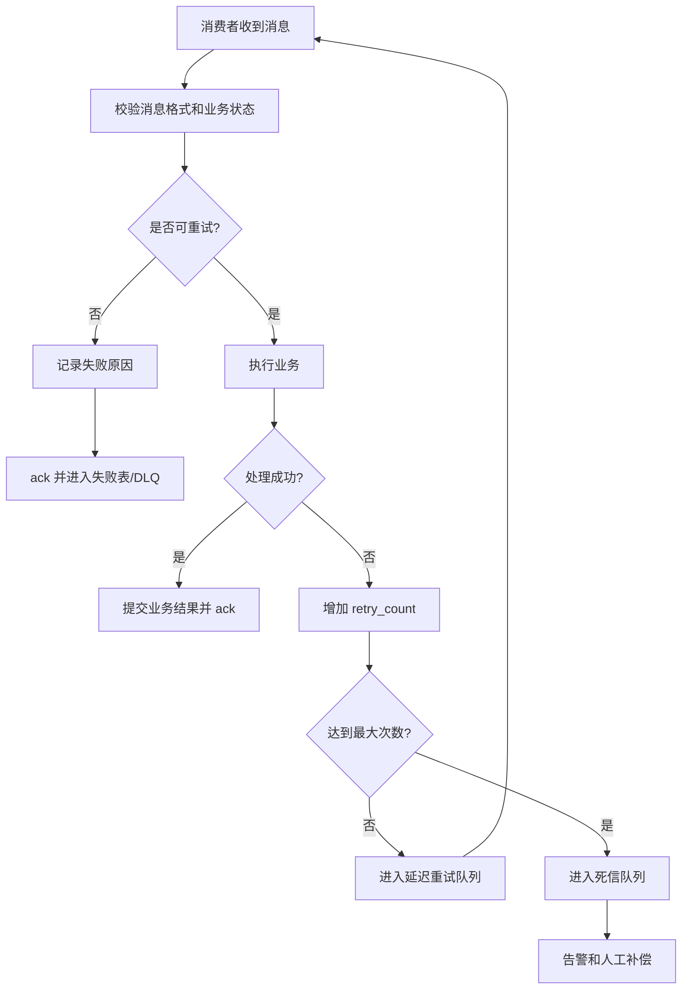

失败要先分类：

| 类型 | 示例 | 处理 |
|---|---|---|---|
| 可重试 | 数据库连接抖动、Redis 超时、RabbitMQ 临时不可用 | 延迟重试 |
| 不可重试 | 字段缺失、订单不存在、状态非法 | 记录原因并 ack，避免阻塞队列 |
| 长期失败 | 多次重试仍然失败 | 死信、告警、人工补偿 |

不能无限重试。建议使用：

```text
第 1 次失败 -> 5 秒后重试
第 2 次失败 -> 30 秒后重试
第 3 次失败 -> 2 分钟后重试
仍然失败 -> DLQ + 告警
```

#### 9.4.6 Exchange、Queue 和 RoutingKey 设计

目标拓扑按业务边界拆分如下：

| Exchange | RoutingKey | Queue | 用途 |
|---|---|---|---|
| `delivery.order.exchange` | `order.paid` | `delivery.order.paid.dispatch.queue` | 支付成功事件 |
| `delivery.dispatch.exchange` | `dispatch.push` | `delivery.dispatch.push.queue` | 推送推荐订单 |
| `delivery.dispatch.exchange` | `dispatch.expand.delay` | `delivery.dispatch.expand.delay.queue` | TTL 延迟扩圈 |
| `delivery.dispatch.exchange` | `dispatch.expand` | `delivery.dispatch.expand.queue` | 延迟到期后的扩圈消费 |

重试队列和死信队列属于基础设施可靠性组件，不作为新的业务事件单独出现在主链路中：

| Exchange | RoutingKey | Queue | 目标用途 |
|---|---|---|---|
| `delivery.order.exchange` | `order.accepted` | `order.accepted.post.queue` | 接单成功后置处理 |
| `delivery.order.exchange` | `order.pay.timeout` | `order.pay.timeout.queue` | 支付超时检查 |
| `cache.evict` Fanout Exchange | `cache.evict` | `cache.evict.{instanceId}.queue` | 各实例本地缓存失效广播 |

延迟队列可以使用 RabbitMQ 延迟消息插件，或者使用 TTL + 死信交换机实现。两者都只是延迟投递机制，真正的业务判断仍由消费者完成。

统一消息结构至少包含：

| 字段 | 作用 |
|---|---|
| `eventId` | 消息唯一 ID，用于幂等 |
| `eventType` | 事件类型，例如 `ORDER_PAID` |
| `bizId` | 业务主键，例如 `orderId` |
| `occurredAt` | 事件发生时间 |
| `retryCount` | 当前重试次数 |
| `traceId` | 链路追踪和故障排查 |

#### 9.4.7 本地消息表最终一致方案

普通 MySQL 事务不能同时保证业务更新和 RabbitMQ 发送原子成功，因此关键事件应记录本地消息，避免业务事务已经提交但消息没有发出的情况。

```text
业务事务更新业务表
-> 同事务写 local_message=INIT
-> 事务提交
-> 投递任务发送 RabbitMQ
-> Confirm ACK 且无 ReturnCallback：local_message=SENT
-> NACK/超时：保留 INIT/RETRY，后续补发
-> ReturnCallback：记录路由失败，进入补偿重发
```

目标方案中的对应关系：

```text
ORDER_PAID：
order_payment/order_main + local_message 同事务提交。

DISPATCH_PUSH、DISPATCH_EXPAND：
dispatch_task/dispatch_offer + local_message 同事务提交。

ORDER_ACCEPTED：
order_main/order_progress + local_message 同事务提交。

运费规则缓存失效：
pricing_rule + local_message 同事务提交，删除 Redis 成功后发布 CACHE_EVICT。
```

这样可以避免支付已经成功但调度没有触发、推荐已经落库但推送事件丢失，以及接单成功但后置收敛事件没有发送等问题。

#### 9.4.8 最终补偿

最终补偿不是简单地“把消息再发一次”，而是根据消息类型恢复对应的业务动作：

| 消息 | 长期失败后的补偿 |
|---|---|
| `ORDER_PAID` | 重新触发调度；仍失败则进入人工调度池 |
| `DISPATCH_PUSH` | 重试推送；最终失败则保留推送失败状态，订单大厅继续兜底 |
| `DISPATCH_EXPAND` | 重新投递扩圈任务；长期失败则告警并人工处理 |
| `ORDER_ACCEPTED` | 补偿推荐记录、调度任务和通知，不能回滚核心接单结果 |
| `CACHE_EVICT` | 重新删除运费规则 Redis Key，并广播各实例清理 Caffeine |
| `ORDER_PAY_TIMEOUT` | 重新查询订单状态，满足条件后执行条件取消 |

#### 9.4.9 监控与告警

RabbitMQ 相关指标至少包括：

```text
Publisher Confirm 失败率
ReturnCallback 触发次数
队列堆积数量
消费失败次数
消息重试次数
死信数量
本地消息表长期未发送数量
WebSocket 推送失败率
人工补偿次数
```

这些指标用于判断消息是否丢失、是否堆积以及失败是否已经进入补偿闭环。

### 9.5 ORDER_PAID：支付成功触发调度

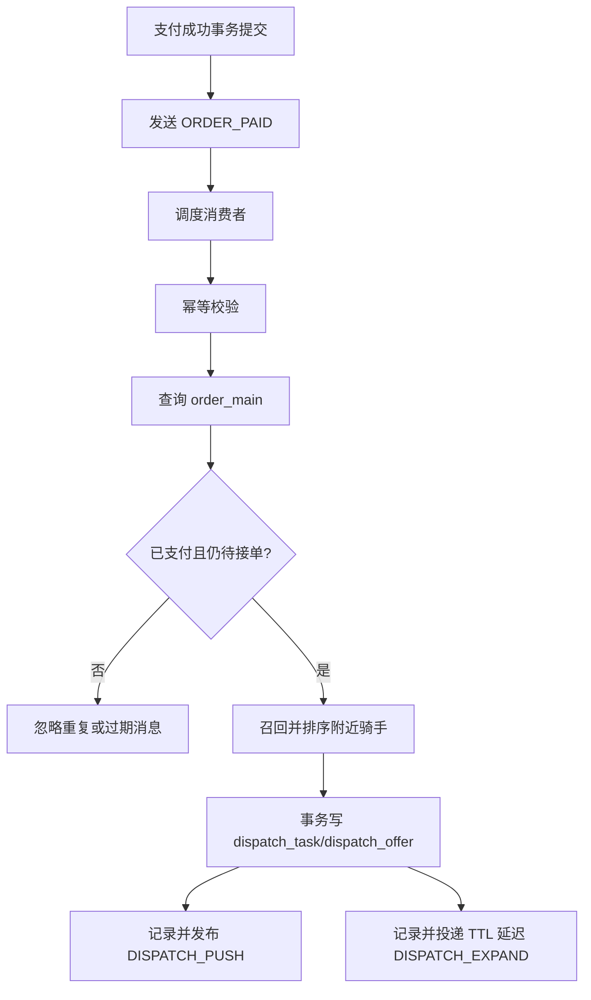

`ORDER_PAID` 的特殊点是：支付成功已经由订单事务确认，调度消费者不能重复创建调度任务，也不能因为一条过期消息把已经接单或已经取消的订单重新放回调度池。`dispatch_task` 可以通过 `order_id + round_no` 唯一约束作为数据库兜底。

### 9.6 DISPATCH_PUSH：推荐推送与 WebSocket 失败

MQ 消费成功和 WebSocket 发送成功不是同一个结果。推送消费者先消费 `DISPATCH_PUSH`，再调用 WebSocket；如果骑手离线或连接失效，只代表实时提醒失败，不代表消息没有被 RabbitMQ 消费。

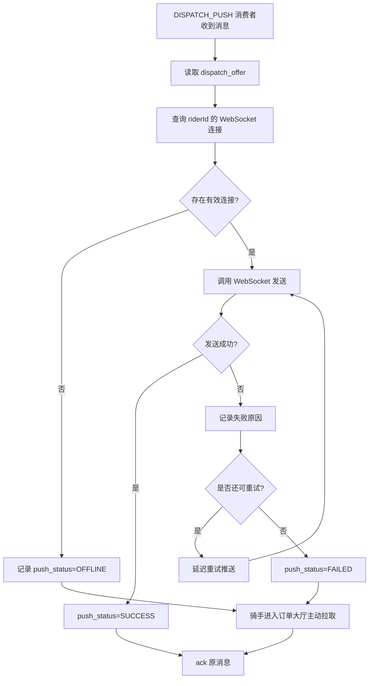

企业级改造时，可以把推送失败投递到专用重试队列，但这属于基础设施重试，不应把它当成新的业务事件；超过次数后记录 `push_status=FAILED` 并告警，订单大厅继续作为兜底入口。

### 9.7 DISPATCH_EXPAND：无人接单延迟扩圈

`DISPATCH_EXPAND` 只负责处理“无人接单后的下一轮调度”。它不是立即执行的同步步骤，而是调度模块在生成本轮推荐后投递的延迟消息：

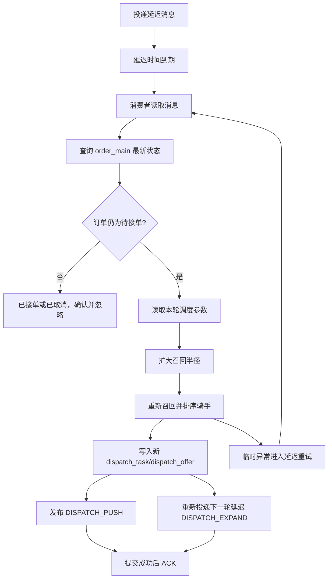

延迟消息不是定时任务扫描全表。消息到期后只处理对应订单，但消费者仍必须重新查库，因为消息到期时订单可能已经支付、接单或取消。


### 9.8 ORDER_ACCEPTED：接单成功后置处理（目标方案）

```mermaid
flowchart TD
    A[接单核心事务已提交] --> B[ORDER_ACCEPTED 投递到队列]
    B --> C[接单后置消费者消费]
    C --> D[查询 order_main]
    D --> E{订单确实已接单?}
    E -- 否 --> F[记录异常并 ack]
    E -- 是 --> G[事务收敛 dispatch_offer/dispatch_task]
    G --> H{后置事务成功?}
    H -- 是 --> I[提交事务并 ack]
    H -- 否 --> J[进入延迟重试]
    J --> K{达到最大重试次数?}
    K -- 否 --> C
    K -- 是 --> L[进入死信队列并告警]
    L --> M[人工补偿推荐、调度和通知]
```

即使 `ORDER_ACCEPTED` 消费失败，也不能回滚模块五已经提交的 `order_main` 接单结果。补偿范围只包括推荐记录、调度任务和通知等后置数据；运费规则缓存由模块七独立维护。

### 9.9 ORDER_PAY_TIMEOUT：支付超时取消（目标方案）

```mermaid
flowchart TD
    A[创建待支付订单] --> B[投递延迟 ORDER_PAY_TIMEOUT]
    B --> C[延迟到期]
    C --> D[支付超时消费者查询 order_main]
    D --> E{仍未支付且订单可取消?}
    E -- 否 --> F[已支付或已取消，确认并忽略]
    E -- 是 --> G[MySQL 条件更新为已取消]
    G --> H{更新成功?}
    H -- 是 --> I[提交事务并 ACK]
    H -- 否 --> J[重新查询状态并结束]
    G --> K[处理异常]
    K --> L[延迟重试，长期失败进入死信]
```

支付超时消息只负责“到时间检查”，不能直接把订单改成取消。消费者必须重新查询并执行条件更新，避免支付回调和超时取消同时到达时误取消已支付订单。

### 9.10 与其他模块的关系

| 关联模块 | MQ 作用 |
|---|---|
| 模块五接单一致性 | 接单核心事务成功后发布 `ORDER_ACCEPTED`，异步关闭推荐、更新调度和通知用户 |
| 模块八骑手推荐 | 消费 `ORDER_PAID` 后召回、排序并生成推荐，发布 `DISPATCH_PUSH` 和延迟 `DISPATCH_EXPAND` |
| 模块七运费规则缓存 | 规则变更后删除 Redis，成功后发布 `CACHE_EVICT`，通知各实例失效 Caffeine |
| 模块九支付链路 | 支付成功产生 `ORDER_PAID`；创建待支付订单时投递延迟 `ORDER_PAY_TIMEOUT` |

### 9.11 性能收益

MQ 模块的价值不是让单个业务操作更简单，而是把原本同步串行的履约链路拆成可重试、可补偿、可观测的事件流。

| 优化前问题 | 本项目方案 | 带来的提升 |
|---|---|---|
| 支付成功后同步创建调度、召回骑手、推送通知 | 支付只更新订单状态并发布 `ORDER_PAID` | 支付主链路不等待调度和推送，接口耗时更稳定 |
| 调度逻辑直接写在支付接口里 | `ORDER_PAID -> 调度消费者 -> DISPATCH_PUSH` | 支付、调度、推送解耦，后续可独立扩展 |
| 无人接单靠定时任务扫描订单 | 延迟 `DISPATCH_EXPAND` 消息 | 避免高频全表扫描，扩圈触发更精准 |
| 消息重复消费可能重复创建调度任务 | 可恢复消费状态 + 数据库唯一约束 | 降低重复消费导致的状态异常 |
| MQ 发送失败可能造成“订单已支付但不调度” | 本地消息表记录待发送事件并定时补偿 | 保证关键业务事件最终投递 |
| 推送、缓存、通知失败影响主流程 | 后置事件异步消费，失败进入重试或死信 | 主链路成功结果不被外围动作回滚 |

简历中的指标和效果可以这样解释：

```text
将支付成功后的调度召回、推荐推送、无人接单扩圈和接单后置处理从同步链路拆为 RabbitMQ 事件驱动，通过本地消息表、Redis 幂等、有限重试和死信补偿保证消息最终可达与消费可控。
```

面试中要强调：MQ 不是为了堆技术，而是让履约链路具备解耦、削峰、重试和补偿能力。

## 10. 模块七：运费规则缓存与缓存一致性

### 10.1 目标

同一个城市和服务类型通常共用一套运费规则，每笔订单计费时都会读取这份规则。该数据具有“读多写少、多个订单共享、规则更新不频繁”的特点，适合使用 `Caffeine + Redis` 多级缓存。

本模块只缓存运费规则和少量共享配置，不缓存接单核心状态、骑手实时位置或推荐结果。订单最终金额在下单时写入 `order_price_snapshot`，历史订单不再依赖后续变化的规则。

### 10.2 运费规则读取链路

```mermaid
flowchart TD
    A[订单计费请求] --> B[根据 cityCode/serviceType 获取规则]
    B --> C{Caffeine 命中?}
    C -- 是 --> D[使用本地规则计算费用]
    C -- 否 --> E{Redis 命中?}
    E -- 是 --> F[写入 Caffeine]
    F --> D
    E -- 否 --> G[查询 MySQL pricing_rule]
    G --> H{规则存在?}
    H -- 否 --> I[缓存空值短 TTL并返回规则不存在]
    H -- 是 --> J[写入 Redis，TTL增加随机值]
    J --> K[写入 Caffeine 短 TTL]
    K --> D
    D --> L[下单时保存 order_price_snapshot]
```

查询顺序是 `Caffeine -> Redis -> MySQL`：

- Caffeine 是当前实例的本地缓存，访问最快；
- Redis 是多个实例共享的缓存；
- MySQL 是运费规则的唯一真实数据源；
- `order_price_snapshot` 固化下单时使用的规则版本、费用明细和最终金额。

规则 Key 可以设计为：

```text
pricing:rule:{cityCode}:{serviceType}
```

订单详情、订单列表、骑手位置和订单接单状态不作为本模块的重点缓存对象。特别是接单时的 `order_main.status` 和 `runner_id`，必须查询 MySQL 最新状态。

### 10.2.1 多级缓存读取细节

```mermaid
sequenceDiagram
    participant O as 订单服务
    participant L1 as Caffeine
    participant L2 as Redis
    participant DB as MySQL

    O->>L1: get(pricing:rule:city:service)
    alt Caffeine 命中
        L1-->>O: 返回运费规则
    else Caffeine 未命中
        O->>L2: get(pricing:rule:city:service)
        alt Redis 命中
            L2-->>O: 返回运费规则
            O->>L1: 写入本地缓存
        else Redis 未命中
            O->>DB: 查询 pricing_rule
            DB-->>O: 返回规则或空结果
            O->>L2: 写入规则或空值，设置 TTL
            O->>L1: 写入本地缓存
        end
    end
    O->>O: 计算运费并返回
```

当前方案不额外设计回源互斥锁。运费规则通过较长 TTL、规则预热和失效后的主动加载降低回源压力；如果后续压测证明规则过期瞬间出现大量回源，再增加回源互斥控制。

### 10.3 运费规则更新与缓存失效

运费规则变更时，数据库是唯一真相源，缓存只负责加速读取。更新顺序采用“先更新数据库，再删除缓存”：

```mermaid
flowchart TD
    A[管理端修改运费规则] --> B[更新 MySQL pricing_rule]
    B --> C[同事务记录 local_message=INIT]
    C --> D[提交数据库事务]
    D --> E[删除 Redis 规则 Key]
    E --> F{Redis 删除成功?}
    F -- 是 --> G[发布 CACHE_EVICT 到 Fanout Exchange]
    G --> H[实例 A 专属 Queue]
    G --> I[实例 B 专属 Queue]
    H --> J[实例 A 删除 Caffeine]
    I --> K[实例 B 删除 Caffeine]
    G --> L[记录消息发送成功]
    L --> M[延迟再次删除 Redis并广播失效]
    F -- 否 --> N[有限次数重试]
    N --> O{仍然失败?}
    O -- 否 --> E
    O -- 是 --> P[写入补偿任务并告警]
    P --> Q[补偿消费者持续删除 Redis]
    Q --> F
```

这里的 `local_message` 用来保证数据库更新成功后，缓存失效任务不会因为应用异常而丢失。Redis 删除成功后，才发布 `CACHE_EVICT`，避免实例先清理 Caffeine、又从旧 Redis 重新加载脏数据。

如果 Redis 删除失败，不能回滚已经提交的运费规则更新，而是将删除任务投递到 RabbitMQ 延迟重试队列或补偿任务表。重试耗尽后标记异常并告警，故障恢复后继续补偿。

如果 Redis 已经删除成功，但 `CACHE_EVICT` 发布失败，`local_message` 保持 `INIT/RETRY`，由补偿任务重新发布失效消息。此时部分实例的 Caffeine 可能暂时保留旧规则，依靠本地短 TTL 和后续广播最终清理。

为了降低并发读线程把旧规则重新写回缓存的概率，可以采用延迟双删：

```text
第一次删除 Redis
-> 广播 CACHE_EVICT，删除各实例 Caffeine
-> 延迟再次删除 Redis
-> 再次广播 CACHE_EVICT
```

`CACHE_EVICT` 必须使用 Fanout Exchange，并为每个应用实例建立独立 Queue。多个实例共用一个 Queue 时，一条消息只会被一个实例消费，无法保证所有实例的 Caffeine 都失效。

### 10.4 缓存异常处理

| 问题 | 运费规则场景 | 处理方式 |
|---|---|---|
| 缓存穿透 | 非法城市或不存在的服务类型反复请求 | 先校验城市和服务类型；不存在的规则缓存空值并设置短 TTL |
| 缓存击穿 | 某城市规则 Key 过期，大量订单同时回源 | 规则预热、较长 TTL、主动刷新；当前不额外设计回源锁 |
| 缓存雪崩 | 多个城市规则同时过期 | Redis TTL 增加随机值，实例启动或规则更新后主动预热 |
| Redis 删除失败 | 数据库已更新，但旧规则仍在 Redis | 有限重试、RabbitMQ 延迟补偿、失败告警 |
| Caffeine 失效消息失败 | 个别实例仍保留旧规则 | Fanout Queue 重试、本地短 TTL 兜底、后台补偿 |

### 10.5 数据一致性边界

缓存短时间残留旧规则时，可能导致少量请求继续使用旧配置，但不会影响历史订单金额，因为订单金额以 `order_price_snapshot` 为准。

规则更新后的目标状态是：

```text
pricing_rule 使用新版本
-> Redis 旧 Key 被删除
-> 各实例 Caffeine 被清理
-> 后续请求重新加载新版本
```

缓存失效失败不能回滚已经提交的规则更新；补偿任务、短 TTL 和规则版本记录负责保证最终收敛。

### 10.6 性能指标与简历表达

建议统计以下指标：

```text
运费规则 Caffeine 命中率
Redis 命中率
MySQL 回源次数
规则缓存失效成功率
缓存删除补偿积压数量
规则更新后的最大旧缓存存活时间
```

缓存命中率应限定在“运费规则查询场景”，不能泛化为整个系统的缓存命中率。

简历可以这样写：

```text
运费规则缓存与一致性：针对同城订单高频读取共享运费规则的场景，搭建 Caffeine + Redis 两级缓存，MySQL 作为最终数据源；规则更新后先更新数据库并删除 Redis，再通过 RabbitMQ Fanout 广播各实例 Caffeine 失效，结合延迟重试和补偿任务保障缓存最终一致；通过空值缓存和随机 TTL 处理缓存穿透与雪崩问题。
```

## 11. 模块八：骑手推荐与实时触达

### 11.1 目标

这个模块对应简历中的“骑手推荐与实时触达”。它解决的是“订单如何更快触达到合适骑手”，不是“骑手是否有资格接单”。最终接单资格和唯一性仍由模块五保证。

必须区分两个入口：

| 入口 | 行为 | 数据来源 | 作用 |
|---|---|---|---|
| 订单大厅 | 骑手主动拉取附近全部可接订单 | `rider_latest_location + order_main.pickup_*` | 保底入口，WebSocket 失败时仍可看单 |
| 推荐触达 | 平台主动推送高匹配订单 | `dispatch_task + dispatch_offer + WebSocket` | 提升订单曝光和接单效率 |

所以推荐不是订单可见性的硬限制。骑手没有收到推荐，也可以在订单大厅看到附近订单；骑手收到推荐，也不代表订单被锁定，点击接单仍然进入模块五的 Redisson + DB 条件更新链路。

### 11.2 市面常见调度方案对比

| 方案 | 做法 | 优点 | 问题 |
|---|---|---|---|
| 全量广播 | 把订单推给同城或大范围骑手 | 简单，曝光大 | 打扰多，远距离骑手抢单影响履约体验 |
| 固定区域派单 | 骑手绑定片区，只看片区订单 | 容易管理 | 骑手流动性强，跨区后不合理 |
| 纯抢单大厅 | 骑手自己刷新附近订单 | 实现简单 | 平台缺少主动调度能力，冷启动订单可能无人看到 |
| 最近骑手优先 | 只按距离排序 | 直观 | 忽略骑手负载、信用、活跃度 |
| 多因子推荐 + 实时触达 | 距离、负载、信用、位置新鲜度综合评分，TopN 推送 | 更接近真实即时配送 | 需要记录推荐、处理推送失败和扩圈 |

本项目采用“订单大厅保底 + 多因子推荐触达”的组合方案。订单大厅保证骑手能主动看附近订单，推荐触达让平台能把新订单优先推给更合适的骑手。

### 11.3 推荐触发时机

推荐不是用户创建订单时触发，而是在订单支付成功、进入待接单状态后触发。原因是未支付订单不应该占用骑手注意力，也不应该进入调度池。

触发链路：

```text
支付成功
-> order_main.status = 待接单
-> 发布 ORDER_PAID MQ 事件
-> 消费 ORDER_PAID
-> 调度消费者直接创建 dispatch_task
-> 召回并评分骑手
-> 写 dispatch_offer
-> 发布 DISPATCH_PUSH
-> WebSocket 推送推荐卡片
```

### 11.4 推荐主流程图

```mermaid
flowchart TD
    A[ORDER_PAID 事件] --> B[调度消费者]
    B --> C[读取 order_main]
    C --> D{订单仍待接单?}
    D -- 否 --> E[忽略调度]
    D -- 是 --> F[读取 pickup_city_code/pickup_lng/pickup_lat]
    F --> G[查询 rider_latest_location]
    G --> H[过滤同城、在线、位置未过期]
    H --> I[排除下单用户和已推荐骑手]
    I --> J[计算骑手到取货点距离]
    J --> K[按本轮半径过滤]
    K --> L[计算距离/负载/信用/活跃分]
    L --> M[排序生成 TopN]
    M --> N[写 dispatch_task]
    N --> O[写 dispatch_offer]
    O --> P[发布 DISPATCH_PUSH]
    P --> Q[WebSocket 推送推荐卡片]
    O --> R[调度模块投递延迟 DISPATCH_EXPAND]
    R --> S{等待后仍无人接单?}
    S -- 是 --> T[扩大半径进入下一轮]
    S -- 否 --> U[停止扩圈]
```

### 11.4.1 推荐生成与接单竞态细节图

```mermaid
sequenceDiagram
    participant D as 调度消费者
    participant DB as MySQL
    participant MQ as RabbitMQ
    participant WS as WebSocket
    participant R1 as 骑手 A
    participant R2 as 骑手 B
    participant API as 接单接口
    participant Lock as Redisson
    participant A as 接单后置消费者

    D->>DB: 查询订单和有效骑手位置
    D->>DB: 写入 dispatch_task/dispatch_offer
    D->>MQ: 发布 DISPATCH_PUSH
    MQ->>WS: 投递 DISPATCH_PUSH
    WS->>WS: 推送消费者读取消息并调用 WebSocket
    WS-->>R1: 推送订单推荐
    WS-->>R2: 推送订单推荐
    R1->>API: 点击接单
    R2->>API: 点击接单
    API->>Lock: 竞争 order:accept:{orderId}
    Lock-->>R1: 获取成功
    Lock-->>R2: 获取失败或稍后重试
    API->>DB: 校验状态、资格、位置和距离
    API->>DB: 条件更新 runner_id/status
    DB-->>API: 只有骑手 A affectedRows=1
    API->>MQ: 发布 ORDER_ACCEPTED
    MQ->>A: 投递 ORDER_ACCEPTED
    A->>DB: 接单后置消费者收敛其他 dispatch_offer
    API-->>R1: 接单成功
    API-->>R2: 订单已被其他骑手接单
```

推荐记录只是“平台曾经推荐过这笔订单”的事实，不是订单锁。推荐记录的 `offer_status` 不能代替 `order_main.status`，最终接单结果仍以模块五的数据库条件更新为准。

### 11.5 字段与表设计

订单侧依赖 `order_main`：

| 字段 | 作用 |
|---|---|
| `id` | 调度任务绑定订单 |
| `status` | 只有待接单订单才参与调度 |
| `runner_id` | 已接单订单不再推荐 |
| `pickup_city_code` | 召回同城骑手 |
| `pickup_lng/pickup_lat` | 计算骑手到取货点距离 |
| `pickup_adcode/pickup_district_name` | 展示和排查问题 |

骑手侧依赖 `rider_latest_location` 和 `user_wx`：

| 表 | 字段 | 作用 |
|---|---|---|
| `rider_latest_location` | `rider_id` | 关联骑手 |
| `rider_latest_location` | `city_code` | 同城过滤 |
| `rider_latest_location` | `lng/lat` | 距离计算 |
| `rider_latest_location` | `is_online` | 只召回在线骑手 |
| `rider_latest_location` | `last_report_time` | 过滤过期定位 |
| `user_wx` | `can_take` | 骑手必须具备接单资格 |
| `user_wx` | `credit_score` | 推荐评分因子 |

调度侧写入 `dispatch_task`：

| 字段 | 作用 |
|---|---|
| `order_id` | 调度对应订单 |
| `round_no` | 第几轮推荐 |
| `trigger_type` | `PAY_SUCCESS`、`EXPAND`、`MANUAL` |
| `city_code` | 本轮调度城市 |
| `pickup_lng/pickup_lat` | 本轮取货点 |
| `radius_km` | 本轮召回半径 |
| `candidate_count` | 候选骑手数量 |
| `recommend_count` | 推荐骑手数量 |
| `status` | 已推送、无人、已接单、待人工等 |

推荐侧写入 `dispatch_offer`：

| 字段 | 作用 |
|---|---|
| `task_id` | 关联调度任务 |
| `order_id` | 关联订单 |
| `rider_id` | 推荐给哪个骑手 |
| `rank_no` | 推荐排序 |
| `distance_to_pickup_m` | 骑手到取货点距离 |
| `dispatch_score` | 综合推荐分 |
| `recommend_reason` | 推荐原因，用于管理端和排查 |
| `push_status` | WebSocket 推送是否成功 |
| `offer_status` | 推荐中、已查看、已接单、已过期 |

### 11.6 多因子评分模型

第一版推荐模型不追求复杂机器学习，而是采用可解释的加权评分：

```text
dispatch_score =
距离分 * 0.50
+ 负载分 * 0.25
+ 信用分 * 0.15
+ 活跃分 * 0.10
```

| 因子 | 数据来源 | 设计思路 |
|---|---|---|
| 距离分 | 骑手实时位置到取货点距离 | 越近越优先，降低取件耗时 |
| 负载分 | 骑手当前进行中订单数 | 负载越低越优先，避免堆单 |
| 信用分 | `user_wx.credit_score` | 服务质量更稳定的骑手优先 |
| 活跃分 | `last_report_time` | 位置越新鲜，骑手越可能在线响应 |

推荐分只影响“推给谁”，不影响最终“谁能接成功”。最终接单仍由模块五校验订单状态、骑手资格和实时距离。

### 11.7 多轮扩圈策略

真实即时配送平台不会只推送一次。第一轮无人接单时，应该逐步扩大召回范围：

| 轮次 | 半径 | TopN | 等待时间 | 目的 |
|---|---|---|---|---|
| 第 1 轮 | 2km | 5 | 30s | 精准推荐最近骑手 |
| 第 2 轮 | 4km | 15 | 60s | 扩大曝光，提升接单概率 |
| 第 3 轮 | 6km | 50 | 60s | 大范围兜底 |
| 兜底 | 人工调度池 | 管理端处理 | 运营介入 | 长时间无人接单 |

扩圈通过 RabbitMQ 延迟消息实现：

```text
创建第 1 轮 dispatch_task
-> 投递延迟 DISPATCH_EXPAND
-> 延迟到期后由扩圈消费者消费
-> 查询 order_main.status
-> 如果仍是待接单，创建下一轮调度
-> 如果已接单，忽略消息
```

这种方式不需要定时全表扫描待接单订单，扩展性更好。

### 11.8 WebSocket 实时触达设计

WebSocket 只负责实时触达，不保证一定送达。

连接建立时：

```text
骑手登录
-> 建立 WebSocket 连接
-> 通过 token 识别 riderId
-> 保存 riderId -> session/channel 映射
```

推送时：

```text
DISPATCH_PUSH 消费者读取 dispatch_offer
-> 根据 riderId 找 WebSocket 连接
-> 在线则推送推荐卡片
-> 推送成功更新 push_status=SUCCESS
-> 不在线或失败更新 push_status=FAILED
```

推送失败不影响订单大厅：

```text
骑手没有收到 WebSocket 推荐
-> 进入订单大厅
-> 仍然按 rider_latest_location + order_main.pickup_* 拉取附近订单
```

所以面试中不能说“WebSocket 一定能送达”。正确说法是：WebSocket 是实时触达渠道，订单大厅是兜底拉取渠道。

### 11.8.1 WebSocket 推送与降级细节图

```mermaid
flowchart TD
    A[DISPATCH_PUSH 消费者] --> B[根据 riderId 查询连接]
    B --> C{骑手存在有效连接?}
    C -- 是 --> D[发送推荐卡片]
    D --> E{发送成功?}
    E -- 是 --> F[dispatch_offer.push_status=SUCCESS]
    E -- 否 --> G[记录失败原因并进入重试]
    G --> H{超过最大重试次数?}
    H -- 否 --> D
    H -- 是 --> I[push_status=FAILED]
    C -- 否 --> J[记录离线状态]
    I --> K[骑手进入订单大厅主动拉取]
    J --> K
    K --> L[按实时位置查询附近可接订单]
    L --> M[展示推荐标记或普通订单]
```

WebSocket 失败只影响实时提醒，不影响订单的可见性和接单资格。推送结果应记录在 `dispatch_offer.push_status` 中，便于重试、排查和统计推送成功率。

### 11.9 接单成功后的推荐记录收敛

当某个骑手接单成功后，需要收敛同一订单的所有推荐记录：

```text
ORDER_ACCEPTED 后置消费者确认订单已接单
-> 在后置事务中收敛推荐记录和调度任务
当前骑手 dispatch_offer.offer_status = ACCEPTED
其他骑手 dispatch_offer.offer_status = EXPIRED
dispatch_task.status = ACCEPTED
后置事务提交成功后：
└── 通知用户和相关骑手

后续扩圈消息到期后独立检查订单状态，发现已接单则忽略
```

目标方案中，模块五只负责提交 `order_main` 和 `order_progress` 的核心接单结果，并在同一事务内记录 `ORDER_ACCEPTED` 本地消息；后续由消息投递器异步发布，接单后置消费者再收敛推荐记录、调度任务和通知。运费规则缓存不属于接单后的缓存失效范围，规则更新时由模块七单独处理。

### 11.10 性能收益与回测指标

推荐触达的价值不是“限制谁能接单”，而是在订单创建后主动提高合适骑手看到订单的概率。和纯订单大厅相比，本项目方案的优化点如下：

| 优化前问题 | 本项目方案 | 带来的提升 |
|---|---|---|
| 骑手只能主动刷新订单大厅 | 支付成功后生成推荐任务并 WebSocket 触达 | 新订单曝光更及时 |
| 同城或大范围广播 | 按取货点距离、负载、信用、活跃度生成 TopN | 减少远距离骑手干扰 |
| 只按距离推荐 | 多因子评分模型 | 避免把订单都推给最近但负载高或位置过期的骑手 |
| 推送失败后骑手看不到订单 | 订单大厅仍按附近订单兜底拉取 | WebSocket 失败不影响订单可见性 |
| 第一轮无人接单后只能人工处理 | RabbitMQ 延迟消息触发多轮扩圈 | 提升偏远订单被接到的概率 |

推荐触达的收益主要体现在这些指标：

| 指标 | 说明 |
|---|---|
| 平均取件距离 | 推荐更近骑手，降低骑手到取货点距离 |
| Top3 命中率 | 历史订单中，实际接单骑手是否出现在推荐 Top3 |
| 首轮接单率 | 第 1 轮推荐后是否有人接单 |
| 平均接单耗时 | 支付成功到骑手接单的时间 |
| 推送成功率 | WebSocket 推送成功数量 / 推荐数量 |

简历中的数据可以这样解释：

```text
基于 50 条模拟订单回测，Top3 推荐命中率约 85%。
```

这个指标不是说系统自动强派成功率，而是说推荐排序能否把“更可能接单、距离更近、状态更好”的骑手排在前面。

如果要写成更优秀的简历表达，可以把指标换成“前后对比”：

```text
将订单曝光方式由纯订单大厅刷新优化为“订单大厅兜底 + TopN 推荐触达”，推荐触达后平均接单耗时较纯大厅刷新模式降低约 30%。
```

这个指标的测试口径可以是：准备一批模拟订单和骑手位置数据，分别对比“只靠骑手大厅刷新”和“支付成功后主动推送 TopN 骑手”两种模式下，从订单进入待接单到被骑手接单的平均耗时。

### 11.11 简历对应表达

这一模块支撑简历中的：

```text
骑手推荐与实时触达：设计多因子推荐模型，综合取件距离、当前负载、信用评分、位置新鲜度生成 TopN 候选骑手，并通过 WebSocket 推送推荐订单；基于 50 条模拟订单回测，Top3 推荐命中率约 85%。
```

面试中要强调：

```text
推荐触达提高曝光效率；订单大厅保证兜底可见；最终接单一致性仍由 Redisson + DB 条件更新保证。
```

## 12. 模块九：支付链路

### 12.1 目标

当前项目支持模拟支付，便于本地验收履约链路。真实微信支付接入后，支付回调需要做签名校验、金额校验、订单状态幂等校验，并在确认支付成功后发布 MQ 事件触发调度。

### 12.2 字段级用例

用户提交订单后创建支付记录：

| 表 | 字段 | 值 |
|---|---|---|
| `order_payment` | `order_id` | 新订单 ID |
| `order_payment` | `actual_payment` | 本单应付金额 |
| `order_payment` | `payment_status` | 未支付 |

模拟支付成功后：

| 表 | 字段 | 值 |
|---|---|---|
| `order_payment` | `payment_status` | 已支付 |
| `order_payment` | `payment_time` | 当前时间 |
| `order_main` | `status` | 待接单 |

随后发送支付成功事件，进入 RabbitMQ 异步调度链路。

## 13. 简历表达与模块对应

### 13.1 简历优化版

```text
即刻达｜同城急送服务
全栈开发工程师
2025.03-2025.09

技术栈：Spring Boot、MySQL、Redis、Redisson、RabbitMQ、Caffeine、WebSocket、微信小程序

项目描述：面向同城即时配送场景，负责下单计费、订单履约、骑手接单、位置服务和推荐调度等功能，重点优化计费性能、抢单一致性和订单处理效率。

项目细节：  
动态计费与价格快照：设计距离、重量、体积重、物品类型、保价和时段附加费等多因子计费模型，通过规则缓存降低计费耗时，并在下单时固化规则版本和费用明细；计费耗时由约 80ms 降至 30ms 以内。
接单一致性保障：采用Redisson 订单级锁 + 状态二次校验 + MySQL 条件更新兜底，解决重复点击、网络重试和多骑手抢单问题；JMeter 模拟 50 名骑手并发抢单，仅 1 个请求成功，重复接单率 0%。
异步订单处理：将支付成功调度、超时取消、无人接单扩圈和接单后置等流程从同步请求中拆分，基于 RabbitMQ 实现事件驱动和延迟消息处理，结合消费幂等、延迟重试和死信补偿提升消息处理可靠性。
运费规则缓存与缓存一致性：针对计费时高频读取的共享运费规则，采用 Caffeine + Redis 两级缓存；规则更新时先更新 MySQL、删除 Redis，再通过 MQ 广播各实例缓存失效，规则查询缓存命中率约 90%。
骑手推荐与实时触达：设计“订单大厅 + TopN 推荐触达”并行模式，支持骑手按自身位置查询附近待接单订单，并在用户支付成功后触发智能调度，综合距离、负载、信用评分和位置新鲜度筛选 TopN 骑手，通过 WebSocket 主动推送；平均接单耗时较纯大厅刷新降低约 30%。
```


### 13.2 指标使用原则

简历中的数据不是越多越好，而是要能解释测试口径。建议保留 3 到 5 个最能支撑项目亮点的指标：

| 指标 | 推荐写法 | 面试解释口径 |
|---|---|---|
| 计费耗时 | `80ms -> 30ms` | 优化前实时查规则并计算，优化后规则缓存和快照复用 |
| 重复接单率 | `降至 0%` | 多骑手并发抢同一订单，最终只有一个 `runner_id` 写入成功 |
| 缓存命中率 | `提升至约 90%` | 运费规则查询优先命中 Caffeine/Redis，统计范围限定为规则读取链路 |
| 附近订单查询 | `< 50ms` | 先按城市、状态、位置时效过滤，再计算距离 |
| 平均接单耗时 | `降低约 30%` | 对比纯订单大厅刷新和 TopN 主动推荐触达 |

这些指标后续可以通过 JMeter、模拟骑手位置数据和订单回测脚本逐步替换成真实测试结果。写简历时不要把每个指标都写成同一个规模，例如全部写 50；更自然的表达是“多骑手并发”“百级骑手位置上报”“模拟订单回测”。

### 13.3 简历五条与模块对应

| 简历点 | 文档模块 |
|---|---|
| 动态计费与价格快照 | 模块三 |
| 接单一致性保障 | 模块五 |
| 异步订单处理与缓存一致性 | 模块六、模块七 |
| 骑手位置服务与附近召回 | 模块二 |
| 骑手推荐与实时触达 | 模块八 |

## 15. 总结

当前项目的最终模型是：

```text
城市开通判断：service_city.city_code/status
地址归属判断：高德解析取货地址 city_code/adcode/lng/lat
附近骑手数量：取货点 + rider_latest_location + 配置半径
骑手看单：骑手实时位置 + order_main.pickup_* + 配置半径
动态计费：pricing_rule.city_code + service_type + 距离/重量/体积/保价/时段
智能调度：order_main.pickup_* 召回附近骑手，TopN 推荐并 WebSocket 触达
接单一致性：Redisson 锁 + order_main 状态二次校验 + 数据库条件更新兜底
异步与缓存：RabbitMQ 事件解耦，Redis/Caffeine 提升高频查询性能
```

